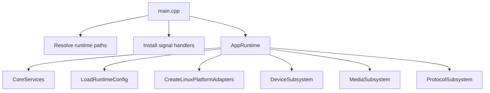

# App Runtime Design

## 模块定位

`app/` 是进程入口和组合根。它拥有服务创建、依赖装配、启动顺序、关闭顺序、
运行路径解析、信号处理和运行时配置加载，不拥有具体业务逻辑、HTTP DTO 或 Web
行为。

## 总体框架图

## 关键职责

- 解析 CLI、环境变量和默认相对路径。
- 安装 SIGINT/SIGTERM 停止处理和 SIGSEGV 最小诊断。
- 启动 `CoreServices` 后加载 `AppRuntimeConfig`。
- 将 `network_ifname`、端口、advertise host、static root 等运行参数传给下游。
- 失败时调用 `Stop()` 回滚已启动子系统。

## 路径策略

路径优先级：

1. `--config-dir <dir>`。
2. `LIVE_STREAM_CONFIG_DIR`。
3. 当前工作目录下的 `configs/*.json`。

`operation.log` 在默认运行中使用相对路径，生产部署可通过 app 路径解析映射到
`/data/operation.log`。Web 静态资源根目录来自运行配置或启动参数 override。

## 运行时配置

`LoadRuntimeConfig()` 从 `config_service` 获取 HTTP、RTSP、ONVIF、WebRTC、
snapshot、network 等运行参数。配置字段的业务语义归对应模块；app 只负责把组合
需要的参数变成启动选项。

## 停止模型

停止信号只设置进程内 stop flag。主循环周期性检查该 flag，然后调用
`AppRuntime::Stop()`。关闭顺序固定为 Protocol、Media、Device、Core。

## 非目标

- 不在 app 层解析 Web DTO。
- 不在 app 层推导媒体 ready 状态。
- 不在 app 层实现平台操作细节；平台操作由 `platform-adapters-design.md` 和对应
  service 负责。
