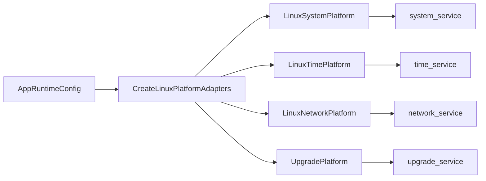

# Platform Adapters Design

## 模块定位

平台适配层把 Linux/板端操作封装为 device service 可调用的接口。`app` 创建具体
Linux 实现并注入 `system_service`、`time_service`、`network_service` 和
`upgrade_service`。

## 总体框架图

## 设计目标

- 将 `/proc`、`/sys`、Linux 命令、网络接口、MTD/升级操作留在平台层。
- device service 只表达业务动作和状态，不直接依赖 Linux 文件路径。
- `network.default_ifname` 由配置决定，默认 fallback 为 `eth0`。

## 资源与失败路径

平台适配动作返回 `bool` 或业务状态默认值。平台层可以读取系统文件和执行升级相关
操作，但不拥有 HTTP 上传、Web 进度展示或配置 JSON 持久化。

## 归属边界

- `LinuxSystemPlatform`：CPU、内存、温度、系统动作等 Linux 状态。
- `LinuxTimePlatform`：系统时间、NTP 应用。
- `LinuxNetworkPlatform`：网卡状态和网络配置应用。
- `UpgradePlatform`：升级包落地后的平台动作、写 flash、重启确认边界。
