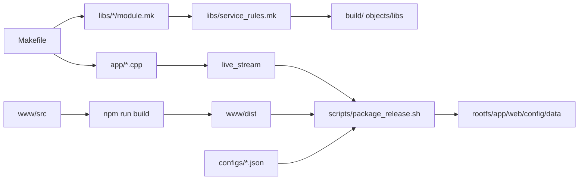

# Build And Deploy Design

## 模块定位

构建和部署设计覆盖根 `Makefile`、`libs/service_rules.mk`、`www` 构建、配置文件、
rootfs 脚本和发布包。它不定义业务接口；接口归拥有模块设计文档。

## 构建框架

## 编译约束

- C++17，`-Wall -Wextra -Werror`。
- 不使用 C++ exceptions 和 RTTI。
- 服务模块复用 `libs/service_rules.mk`，不复制通用规则。
- 交叉编译器和板端库由根构建配置决定；HiSilicon MPP/NNIE/IVE 依赖在
  `3rdparty/` 中集中管理。

## 运行路径

默认相对路径：

- 业务配置：`configs/business_config.json`
- 默认配置：`configs/default_config.json`
- 认证用户：`configs/auth_users.json`
- 操作日志：`log/operation.log`

运行时可以通过 `--config-dir <dir>` 或 `LIVE_STREAM_CONFIG_DIR` 改变配置目录。
生产部署使用 `/config`、`/data`、`/www`、`/opt/app` 等板端路径时，由 app
路径解析和启动脚本共同保证。

## 发布包关系

发布包由 `scripts/package_release.sh`、`scripts/package_debug.sh`、rootfs init
脚本和 PC 工具配合生成。SPI NOR 分区、烧写和 Web 升级细节见
`../app/upgrade-runtime-design.md` 与 `../operations/release-package-design.md`。
