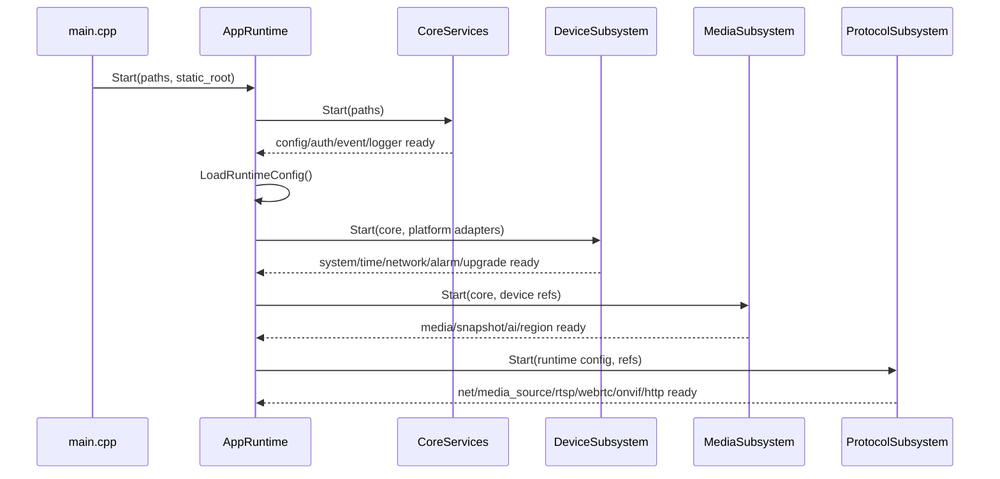

# Runtime Composition Design

## 模块定位

运行时组合由 `app/AppRuntime` 负责。它把 Core、Device、Media、Protocol 四个
子系统按依赖顺序启动，并在停止时反向关闭，保证对外协议入口只在后端资源可用后
暴露。

## 启动顺序

`ProtocolSubsystem` 内部先启动 `net_service` 和 `media_source_service`，再启动
RTSP、WebRTC、ONVIF 和 HTTP。HTTP 最后启动，因为它聚合 Web Console、配置、
媒体状态、直播入口和运维 API。

## 关闭顺序

停止顺序与启动相反：

1. `ProtocolSubsystem`
2. `MediaSubsystem`
3. `DeviceSubsystem`
4. `CoreServices`

协议入口先关闭，避免 HTTP/RTSP/WebRTC 继续访问已释放的媒体、设备或配置资源。

## 子系统边界

- `CoreServices`：logger、config、event、auth。它不依赖 device/media/protocol。
- `DeviceSubsystem`：system、time、network、alarm、upgrade 和 Linux platform。
- `MediaSubsystem`：media、snapshot、AI、region 和 `hisi_vendor` SDK 边界。
- `ProtocolSubsystem`：net、media source service、RTSP、WebRTC、ONVIF、HTTP。

## 依赖注入规则

组合根创建具体实现，模块只接收窄接口。跨模块传递优先使用 public interface：
`IConfigService`、`IAuthService`、`ILoggerService`、`IEventService`、
`IMediaService`、`IMediaSource`、`IMediaFlvSource`、`IMediaMjpegSource`、
`IWebrtcService` 等。

HTTP 依赖最宽，原因是它是 Web Console 的统一边界。HTTP 的宽依赖不能反向污染
业务模块；DTO、认证边界和路由保持在 HTTP 内部。

## 失败处理

- Core、Device、Media 或 HTTP 启动失败时，`AppRuntime::Stop()` 回滚已启动资源。
- RTSP、WebRTC、ONVIF 启动失败时，当前实现允许继续无对应协议运行。
- `media_source_service` 启动失败会阻断协议子系统，因为 RTSP/WebRTC/HTTP 直播
  均依赖它。
