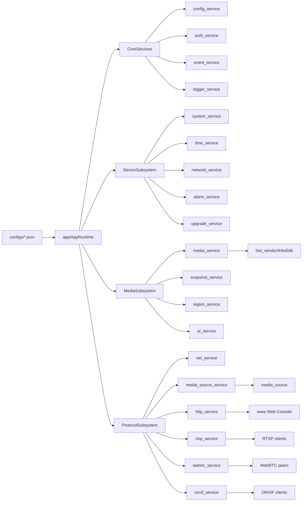

# live_stream 总体框架设计

## 设计目标

`live_stream` 是 HiSilicon IPC 侧的视频实时预览、抓图、配置和运维管理程序。
产品范围固定为视频，不实现音频采集、音频编码、音频传输、录像、存储回放或相关
UI/API。整体设计目标是让硬件媒体链路、协议服务、HTTP API 和 Web Console 的状态
来源清晰，并让每个模块只拥有最接近真实资源的状态。

## 总体框架图



## 工程分层

- `app/` 是组合根，负责路径解析、服务创建、依赖注入、启动顺序和关闭顺序。
- `libs/*` 是业务和协议模块。模块通过 public interface、Options、
  Dependencies 或构造参数协作，不通过全局单例互相发现。
- `configs/` 是运行时 JSON 配置和认证用户配置的默认位置。
- `www/` 是 IPC/NVR 管理台，只消费 HTTP API 和 ready/status 字段。
- `scripts/` 和 `tools/` 负责打包、rootfs 脚本、质量扫描和板端交付。
- `3rdparty/` 是第三方依赖区域，不作为设计改动入口。

## 核心数据流

- 配置流：`configs/default_config.json` 和 `configs/business_config.json` 进入
  `config_service`，各模块通过 config attachment 校验并应用自己的 scope。
- 视频流：`media_service` 从 MPP/VI/VPSS/VENC 获取编码帧，输出给
  `media_source_service`，再分发到 RTSP、WebRTC、HLS、HTTP-FLV 和 MJPEG。
- 抓图流：`snapshot_service` 通过 `media_service` 和 `hisi_vendor` 获取 JPEG，
  `http_service` 只负责 HTTP 路由和响应。
- 运维流：Web Console 调用 `http_service`，HTTP handler 调用对应模块接口，
  操作结果通过 `logger_service` 记录。
- 事件流：`event_service` 只承载轻量状态/控制事件，不承载媒体帧、二进制数据、
  凭据或大 JSON。

## 依赖方向

允许方向：

```text
app -> libs/* -> libs/infra_service or shared media/common headers
www -> HTTP API
scripts -> package/runtime files
```

禁止方向：

```text
libs/* -> app
libs/* -> www
www -> device SDK or backend config internals
media/protocol hot path -> normal diagnostic logging
```

## 状态所有权

- 真实硬件状态归 `media_service`、`hisi_vendor` 和对应 device service。
- 浏览器播放状态归 `media_source`，例如 `browser_codec`、`hls_ready`、
  `flv_ready`、`mjpeg_ready`。
- 协议 session 状态归各协议模块：RTSP、WebRTC、ONVIF、HTTP。
- Web 页面只展示后端状态，不猜设备内部状态。
- 配置语义归拥有模块，HTTP 和 Web 只做 DTO 转换和消费。

## 迁移口径

生产主链路以 `media_source` 和 `media_source_service` 为准。旧
`stream_hub_service` 只作为历史兼容或迁移说明保留，不再写成当前生产架构的主
模块。
