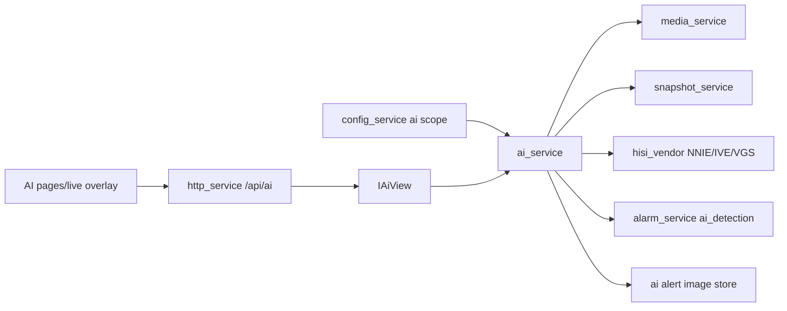

# ai_service Design

## 模块定位

`ai_service` 是唯一 AI 业务入口，拥有 AI 配置、抓帧调度、推理后端、推理结果、
AI 告警图片记录和告警联动。AI 是默认关闭的可选能力，不影响直播、抓图和系统启动。

## 总体框架图

## 核心职责

- `ai.enabled=false` 时只挂配置和状态接口，不创建推理后端和抓帧线程。
- 配置热应用：关闭会停止推理链路，开启或修改后端/任务/模型/阈值会重建链路。
- 默认使用子码流，默认推理间隔 500ms。
- 设备构建支持 NNIE `.wk` 模型加载、VGS resize、IVE CSC、NNIE forward/query。
- `motion_classification` 可使用 IVS_MD，不依赖 `.wk` 模型。
- 维护最近推理结果、统计、告警图片和 `/api/ai/*` view。
- 有检测结果时向 `alarm_service` 注入 `ai_detection`。

## 接口归属

public API 在 `ai_service.h`：

- `AiService`
- `IAiView`
- `AiServiceOptions`
- AI 配置、检测结果、统计和告警记录结构。

HTTP 路由由 `http_service` 实现，但业务语义归本模块：

- `GET /api/ai/status`
- `GET /api/ai/alerts`
- `GET /api/ai/alerts/{id}/image`
- `PUT /api/config/ai`

## 模型和资源

默认模型路径为 `models/inst_ssd_cycle.wk`，开发参考和模型资源保存在
`3rdparty/hisi_svp`。设备构建默认链接 `libnnie.a`、`libmd.a` 和 `libive.a`。

AI 告警图片默认保存到运行目录下的 `ai_alerts` 存储，保留最近有限条目。该存储不是
录像、回放或长期归档。

## 状态与资源模型

AI 运行状态包含启用状态、后端可用性、抓帧/推理线程、最近一次推理结果、统计指标和
告警图片索引。配置关闭或热应用失败时必须释放推理后端和抓帧资源；`/api/ai/status`
只能反映 AI 自身状态，不能阻塞直播 ready。

## 音视频专项边界

AI 抓帧和推理必须保护实时预览主链路。抓帧和 NNIE forward 不持有 AI 状态锁，
状态查询、停止和告警读取不能被单次推理长时间阻塞。

## 风险与优化方向

- CPU 前处理可能影响实时性，设备构建优先使用 VGS + IVE。
- 模型输入格式、色彩顺序和输出后处理必须和 `.wk` 模型一致。
- AI 失败只更新状态和统计，不影响直播。
- AI 联动不启用录像、回放或长期存储。
