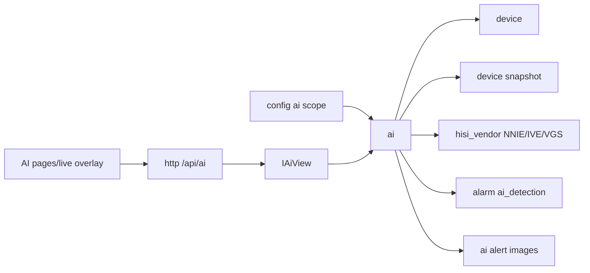

# ai

## 命名迁移

本模块命名迁移遵循仓库根目录 `重构.md` 的“任务 1 命名迁移基线”。后续目录、静态库、public header、接口类、Options/Dependencies/Stats、工厂函数和变量名只按该基线迁移；本文件中的旧 `_service`、`stream_*`、`MetaRtc*` 或 `Yang*` 名称仅表示迁移前名称、历史说明或明确允许保留的协议概念。HTTP REST 路径、配置 schema、Web DTO 和 ONVIF 返回路径可以随完全重构同步迁移；变更必须在同一任务内更新调用方、配置样例和文档，不保留旧兼容适配。

## 模块定位

`ai` 是唯一 AI 业务入口，拥有 AI 配置、抓帧调度、推理后端、推理结果、
AI 告警图片记录和告警联动。AI 是默认关闭的可选能力，不影响直播、抓图和系统启动。

## 总体框架图

## 核心职责

- `ai.enabled=false` 时只挂配置和状态接口，不创建推理后端和抓帧线程。
- 配置热应用：关闭会停止推理链路，开启或修改后端/任务/模型/阈值会重建链路。
- 默认使用子码流，默认推理间隔 500ms。
- 设备构建支持 NNIE `.wk` 模型加载、VGS resize、IVE CSC、NNIE forward/query。
- 生产配置只接受 `hisi3516dv300_nnie` 后端；host stub 只用于测试/mock，不作为设备
  配置或 Web 选项暴露。
- 当前运行模型是多任务模型：Web 只暴露 `ai.tasks[]` 中
  `object_detection`、`perimeter_detection`、`motion_classification` 和
  `occlusion_detection` 的独立开关和一个全局灵敏度；保存配置时由任务开关自动
  派生 `ai.enabled` 这个内部运行闸门，并把隐藏的模型、码流、输入尺寸、
  推理间隔和结果数收敛为一份共享运行配置。
- `perimeter_detection` 复用目标检测模型，只把人员、车辆、自行车等目标在
  `perimeter_regions` 区域内的结果作为周界告警。
- `motion_classification` 可使用 IVS_MD，不依赖 `.wk` 模型。
- 维护最近推理结果、统计、告警图片和 `/api/ai/*` view。
- 有检测结果时向 `alarm` 注入 `ai_detection`。

## 接口归属

public API 在 `ai.h`：

- `Ai`
- `IAiView`
- `AiOptions`
- AI 配置、检测结果、统计和告警记录结构。

HTTP 路由由 `http` 实现，但业务语义归本模块：

- `GET /api/ai/status`
- `GET /api/ai/alerts`
- `GET /api/ai/alerts/{id}/image`
- `PUT /api/config/ai`

`GET /api/ai/status` 返回 `enabled`、完整 `config`、汇总 `summary` 和每个任务的
`tasks[]` 状态；每个任务状态包含任务配置、统计和最近一次结果。`GET /api/ai/alerts`
返回最新告警抓拍列表，Web Console 在 AI 页面右侧按卡片列表展示最近 10 张。
周界抓拍卡片上的 `person`、`vehicle` 等标签来自目标检测模型类别，表示进入周界区域
的目标类别，不表示周界事件被错误归类为目标检测任务。

## 模型和资源

默认模型路径为 `models/inst_ssd_cycle.wk`，开发参考和模型资源保存在
`3rdparty/hisi_svp`。`object_detection` 和 `perimeter_detection` 使用现有 VOC SSD
12 输出节点后处理。当前设备配置不暴露人脸检测任务；人脸需要专用 `.wk` 模型和
匹配后处理后再单独接入。设备构建默认链接 `libnnie.a`、`libmd.a` 和 `libive.a`。

`perimeter_regions` 是可选归一化矩形数组，字段为 `name`、`x`、`y`、`width`、
`height`。空数组表示整幅画面都是周界区域。

AI 告警图片默认保存到运行目录下的 `ai_alerts` 存储，保留最近有限条目。该存储不是
录像、回放或长期归档。

## 状态与资源模型

AI 运行状态包含总启用状态、每个任务的后端可用性、抓帧/推理线程、最近一次推理结果、
统计指标和告警图片索引。每个启用任务拥有独立推理后端和 executor；AI 抓帧入口共享
串行化保护，避免多个任务同时阻塞 VPSS。配置关闭或热应用失败时必须释放推理后端和
抓帧资源；`/api/ai/status` 只能反映 AI 自身状态，不能阻塞直播 ready。
组合根停止时，`ai` 必须在 `device` 之前停止，确保推理线程和告警抓拍不再访问
即将释放的 device snapshot 或 MPP channel。

## 音视频专项边界

AI 抓帧和推理必须保护实时预览主链路。抓帧和 NNIE forward 不持有 AI 状态锁，
状态查询、停止和告警读取不能被单次推理长时间阻塞。

## 风险与优化方向

- CPU 前处理可能影响实时性，设备构建优先使用 VGS + IVE。
- 模型输入格式、色彩顺序和输出后处理必须和 `.wk` 模型一致。
- AI 失败只更新状态和统计，不影响直播。
- AI 联动不启用录像、回放或长期存储。
