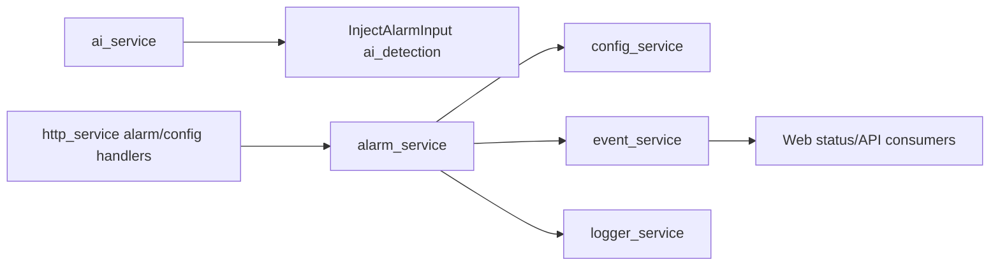

# alarm_service Design

## 模块定位

`alarm_service` 负责视频产品范围内的告警规则、告警输入、当前告警状态和告警事件。
它不拥有录像、存储回放或音频告警能力。

## 总体框架图

## 核心职责

- 维护 `AlarmRule` 和 `AlarmStatus`。
- 接收 motion、AI detection、IO、tamper、network 等告警输入。
- 按规则触发 `kAlarmTriggered`。
- 记录规则修改和清除操作。

## 接口归属

public API 在 `alarm_service.h`。AI 告警图片归 `ai_service`，告警规则和触发状态归
`alarm_service`。

## 状态与资源模型

告警状态是轻量内存状态，不是录像索引或长期存储。AI 启用时只注入
`AlarmSource::kAiDetection`，不启用录像、回放或长期保存。

## 风险与优化方向

- 告警输入应节流或按 `min_duration_ms` 处理，避免频繁事件淹没 Web 和日志。
- 新增告警源必须明确是否属于视频产品范围。
