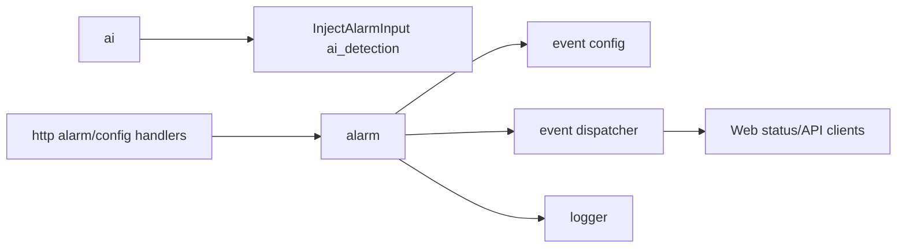

# alarm

## 迁移状态

`alarm` 独立库已并入 `event`。本文件只保留历史迁移说明和告警契约索引；
长期设计正文维护在 `event.md`，AI 图片归 `ai.md`，HTTP 路由归 `http.md`。

public header 名称保持 `alarm.h`，实际路径为 `libs/event/include/alarm.h`。
public API 名称保持 `IAlarm`、`AlarmOptions`、`AlarmRule`、`AlarmStatus`、
`CreateAlarm()`。

## 历史模块定位

独立 `alarm` 模块曾负责视频产品范围内的告警规则、告警输入、当前告警状态和告警事件。
这些职责现在由 `event` 库内的 alarm 功能承担。它不拥有录像、存储回放或音频告警能力。

## 总体框架图

## 核心职责

- 维护 `AlarmRule` 和 `AlarmStatus`。
- 接收 motion、AI detection、IO、tamper、network 等告警输入。
- 按规则发布 `kAlarmOn` 和 `kAlarmOff`。
- 记录规则修改和清除操作。

## 接口归属

public API 在 `libs/event/include/alarm.h`。AI 告警图片归 `ai`，告警规则和触发状态
归 `event` 内的 alarm 功能。

HTTP 路由由 `http` 实现，但业务语义归本模块：

- `GET /api/alarm/status`

`/api/alarm/status` 返回当前告警模块是否可用和轻量运行态：
`active`、`source`、`active_since_ms`、`last_trigger_time_ms`、`level`、
`message` 和 `sources`。顶层字段是 aggregate 状态，`sources` 保存每个告警源的
`enabled`、`waiting`、`active`、`waiting_since_ms`、`active_since_ms`、
`last_alarm_time_ms`、`level` 和 `message`。
时间戳使用系统毫秒时间，供 Web Console 直接格式化展示；持续时间判断仍由模块内部
单调时钟完成。

规则字段中 `min_duration_ms` 表示输入持续多久才转为 active；`repeat_interval_ms`
表示同一来源两次告警事件之间的最小间隔；`manual_clear=true` 时输入恢复正常不会
自动解除告警，必须调用 `ClearAlarm`。

## 状态与资源模型

告警状态是轻量内存状态，不是录像索引或长期存储。AI 启用时只注入
`AlarmSource::kAiDetection`，不启用录像、回放或长期保存。AI 告警规则未启用时，
AI 仍可保存抓拍图片，但不会发布 `kAlarmOn` 系统告警事件。

## 非目标

- 不实现录像、回放、云推送或长期告警归档。
- 不拥有 AI 告警图片存储；该存储归 `ai`。

## 风险与优化方向

- 告警输入应节流或按 `min_duration_ms` 处理，避免频繁事件淹没 Web 和日志。
- 新增告警源必须明确是否属于视频产品范围。
