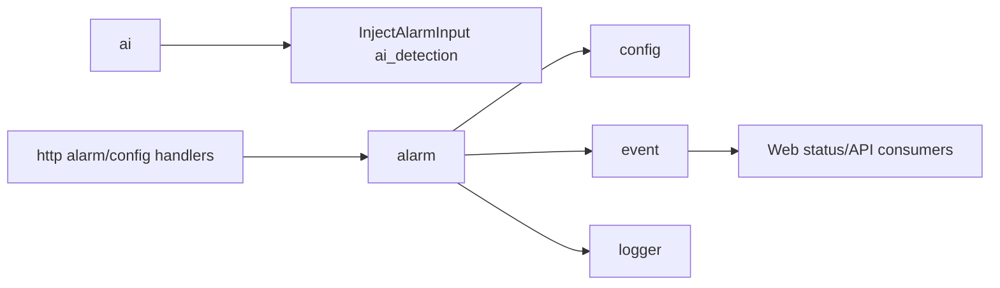

# alarm

## 命名迁移

本模块命名迁移遵循仓库根目录 `重构.md` 的“任务 1 命名迁移基线”。后续目录、静态库、public header、接口类、Options/Dependencies/Stats、工厂函数和变量名只按该基线迁移；本文件中的旧 `_service`、`stream_*`、`MetaRtc*` 或 `Yang*` 名称仅表示迁移前名称、历史说明或明确允许保留的协议概念。HTTP REST 路径、配置 schema、Web DTO 和 ONVIF 返回路径可以随完全重构同步迁移；变更必须在同一任务内更新调用方、配置样例和文档，不保留旧兼容适配。

## 模块定位

`alarm` 负责视频产品范围内的告警规则、告警输入、当前告警状态和告警事件。
它不拥有录像、存储回放或音频告警能力。

## 总体框架图

## 核心职责

- 维护 `AlarmRule` 和 `AlarmStatus`。
- 接收 motion、AI detection、IO、tamper、network 等告警输入。
- 按规则触发 `kAlarmTriggered`。
- 记录规则修改和清除操作。

## 接口归属

public API 在 `alarm.h`。AI 告警图片归 `ai`，告警规则和触发状态归 `alarm`。

HTTP 路由由 `http` 实现，但业务语义归本模块：

- `GET /api/alarm/status`

`/api/alarm/status` 返回当前告警模块是否可用和轻量运行态：
`active`、`source`、`active_since_ms`、`last_trigger_time_ms`、`message`。
时间戳使用系统毫秒时间，供 Web Console 直接格式化展示；持续时间判断仍由模块内部
单调时钟完成。

## 状态与资源模型

告警状态是轻量内存状态，不是录像索引或长期存储。AI 启用时只注入
`AlarmSource::kAiDetection`，不启用录像、回放或长期保存。AI 告警规则未启用时，
AI 仍可保存抓拍图片，但不会发布 `kAlarmTriggered` 系统告警事件。

## 非目标

- 不实现录像、回放、云推送或长期告警归档。
- 不拥有 AI 告警图片存储；该存储归 `ai`。

## 风险与优化方向

- 告警输入应节流或按 `min_duration_ms` 处理，避免频繁事件淹没 Web 和日志。
- 新增告警源必须明确是否属于视频产品范围。
