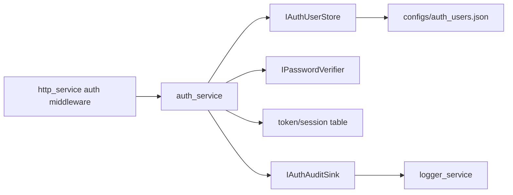

# auth_service Design

## 模块定位

`auth_service` 统一管理登录、token、session、权限和密码修改。它不拥有 HTTP
路由、操作日志存储或 Web session UI。

## 总体框架图

## 核心职责

- 登录、登出、token 校验和权限检查。
- 管理 token TTL、最大 session、锁定策略和密码策略。
- 支持 PBKDF2 密码凭据，不把密码、token 或认证头写入审计。
- 通过 `IAuthAuditSink` 输出认证审计，由 app 适配到 `logger_service`。

## 接口归属

public API 在 `auth_service.h`。HTTP 路由归 `http_service`，Web 认证状态归
`www/AuthContext`。

## 初始密码策略

`admin/admin` 只作为初始设置路径。后端返回 `must_change_password` 时，Web 必须
先调用改密 API，再进入管理台。RTSP 和 ONVIF 认证拒绝工厂密码，直到密码修改成功。

## 风险与优化方向

- 审计记录不得包含敏感明文。
- 权限点要按管理动作收敛，避免每个 handler 自行判断角色。
- 用户存储变更必须保持 `auth_users.json` 向后兼容。
