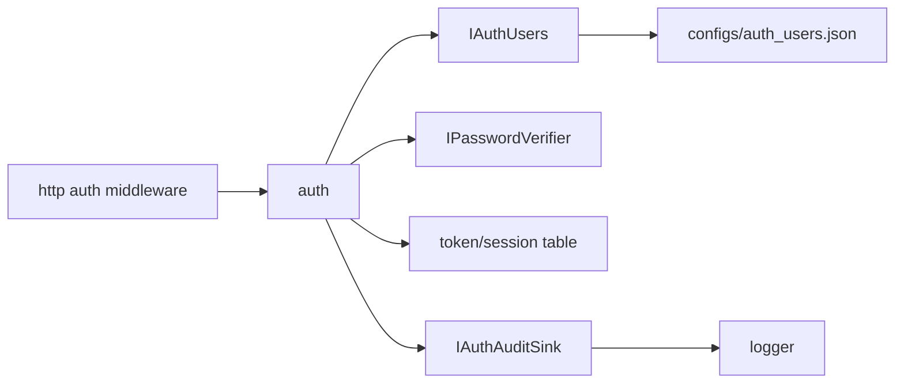

# auth

## 命名迁移

本模块命名迁移遵循`docs/refactor/README.md` 的命名规则。后续目录、静态库、public header、接口类、Options/Dependencies/Stats、工厂函数和变量名只按该基线迁移；本文件中的旧 `_service`、`stream_*`、`MetaRtc*` 或 `Yang*` 名称仅表示迁移前名称、历史说明或明确允许保留的协议概念。HTTP REST 路径、配置 schema、Web DTO 和 ONVIF 返回路径可以随完全重构同步迁移；变更必须在同一任务内更新调用方、配置样例和文档，不保留旧兼容适配。

## 模块定位

`auth` 统一管理登录、token、session、权限和密码修改。它不拥有 HTTP
路由、操作日志文件或 Web session UI。

## 总体框架图

## 核心职责

- 登录、登出、token 校验和权限检查。
- 管理 token TTL、最大 session、锁定策略和密码策略。
- 支持 PBKDF2 密码凭据，不把密码、token 或认证头写入审计。
- 通过 `IAuthAuditSink` 输出认证审计，由 app 适配到 `logger`。

## 接口归属

public API 在 `auth.h`。HTTP 路由归 `http`，Web 认证状态归
`www/AuthContext`。

## 初始密码策略

`admin/admin` 只作为初始设置路径。后端返回 `must_change_password` 时，Web 必须
先调用改密 API，再进入管理台。RTSP 和 ONVIF 认证拒绝工厂密码，直到密码修改成功。

## 状态与资源模型

认证用户由 `IAuthUsers` 持久化，当前 app 适配到 `configs/auth_users.json`。
session/token 表是进程内运行状态，受 TTL、最大 session 和锁定策略限制；重启后不作为
持久登录凭据恢复。

## 非目标

- 不保存明文密码、token 或认证头。
- 不拥有 HTTP cookie/header 解析和 Web 页面跳转。

## 风险与优化方向

- 审计记录不得包含敏感明文。
- 权限点要按管理动作收敛，避免每个 handler 自行判断角色。
- 认证用户变更必须保持 `auth_users.json` 向后兼容。
