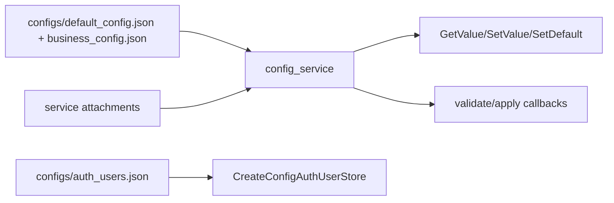

# config_service Design

## 模块定位

`config_service` 是全局配置中心，负责加载、保存、默认值、配置 scope 的
validate/apply attachment，以及认证用户存储适配。业务配置语义由拥有模块定义，
`config_service` 负责配置生命周期和原子应用边界。

## 总体框架图

## 核心职责

- 启动时加载默认配置和业务配置。
- 为每个 scope 提供 `GetValue`、`SetValue`、`GetDefault`、`SetDefault`。
- 通过 `ConfigAttachment` 先 validate 再 apply，失败时拒绝配置变更。
- 提供 `CreateConfigAuthUserStore()` 给 `auth_service` 持久化认证用户。

## 接口归属

public API 在 `libs/config_service/include/config_service.h`。配置字段正文归对应
模块文档，例如 video/image 归 `media_service`，overlay 归 `region_service`，
AI 归 `ai_service`，network 归 `network_service`，snapshot 归 `snapshot_service`。

## 产品范围守卫

`CoreServices` 会为 `audio` scope 安装守卫，允许 disabled 兼容字段存在，但拒绝
启用音频。其他不支持范围也应由拥有模块或组合根守卫处理。

## 风险与优化方向

- 配置字段含义必须向后兼容。
- HTTP、Web DTO 和拥有模块配置应用必须同步，避免保存成功但运行态未应用。
- 不要在 config service 中加入设备 SDK 解析或前端 DTO 逻辑。
