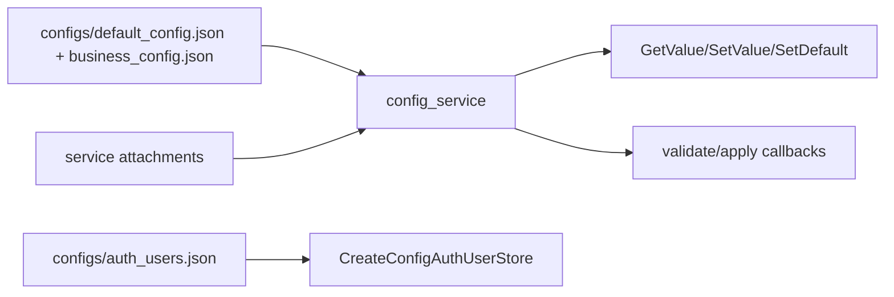

# config_service Design

## 模块定位

`config_service` 是全局配置中心，负责加载、保存、默认值、配置 scope 的
validate/apply attachment，以及认证用户存储适配。业务配置语义由拥有模块定义，
`config_service` 负责配置生命周期和原子应用边界。

## 总体框架图

## 核心职责

- 启动时加载默认配置和业务配置。
- 为每个 scope 提供 `GetValue`、`SetValue`、`GetDefault`、`SetDefault`。
- 通过 `ConfigAttachment` 先 validate 再 apply，失败时拒绝配置变更。
- 提供 `CreateConfigAuthUserStore()` 给 `auth_service` 持久化认证用户。

## 接口归属

public API 在 `libs/config_service/include/config_service.h`。配置字段正文归对应
模块文档，例如 video/image 归 `media_service`，overlay 归 `region_service`，
AI 归 `ai_service`，network 归 `network_service`，snapshot 归 `snapshot_service`。

配置 scope 归属：

| scope | 语义归属 | 说明 |
| --- | --- | --- |
| `video` / `image` | `media_service` | 视频编码、ISP 图像策略和能力应用 |
| `overlay` | `region_service` | OSD、隐私遮挡和坐标合法性 |
| `ai` | `ai_service` | AI 开关、后端、模型、阈值和告警联动 |
| `network` | `network_service` | 网口、DHCP/static、DNS、端口展示 |
| `snapshot` | `snapshot_service` | 抓图开关、路径、质量和超时 |
| `rtsp` / `webrtc` / `onvif` / `http` | 对应协议模块 | 协议开关、监听端口、认证和会话上限 |
| `time` / `system` / `alarm` / `log` | 对应设备或基础模块 | 设备管理、告警和日志运行配置 |
| `audio` | `CoreServices` 守卫 | 兼容字段，只允许 disabled |
| `user` | `auth_service` + `CreateConfigAuthUserStore` | 认证用户和密码策略存储 |

`config_service` 只保证 JSON 加载、默认值、scope 原子替换和 validate/apply 调用顺序。
字段枚举值、取值范围、热应用失败回滚策略和 HTTP DTO 映射都归拥有模块。

## 产品范围守卫

`CoreServices` 会为 `audio` scope 安装守卫，允许 disabled 兼容字段存在，但拒绝
启用音频。其他不支持范围也应由拥有模块或组合根守卫处理。

## 状态与资源模型

运行配置来自 `configs/default_config.json` 和 `configs/business_config.json`，认证用户
来自 `configs/auth_users.json`。`SetValue` 成功必须代表 validate 和 apply 都成功；
失败时调用方不能把 Web 保存状态当作硬件运行态。配置服务不缓存 SDK 句柄，也不直接
启动或停止业务资源。

## 风险与优化方向

- 配置字段含义必须向后兼容。
- HTTP、Web DTO 和拥有模块配置应用必须同步，避免保存成功但运行态未应用。
- 不要在 config service 中加入设备 SDK 解析或前端 DTO 逻辑。
