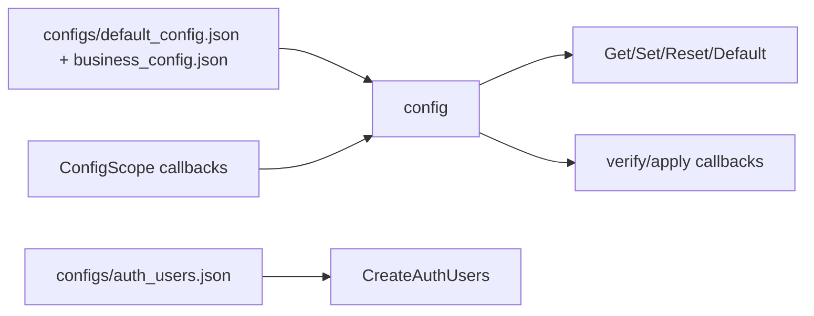

# config

## 迁移状态

`config` 独立库已并入 `event`。本文件只保留历史迁移说明和配置契约索引；
长期设计正文维护在 `event.md` 和拥有具体配置字段的模块文档中。

public header 名称保持 `config.h`，实际路径为 `libs/event/include/config.h`。
public API 名称保持 `IConfig`、`ConfigOptions`、`ConfigScope`、`CreateConfig()`。

## 历史模块定位

独立 `config` 模块曾负责加载、保存、默认值、配置 scope 的 verify/apply 回调。
这些职责现在由 `event` 库内的配置中心承担。业务配置语义仍由拥有模块定义，
配置中心只负责配置生命周期和原子应用边界。

## 总体框架图

## 核心职责

- 启动时加载默认配置和业务配置。
- 为每个 scope 提供 `Get`、`Set`、`Default`、`Reset` 和 `ResetAll`。
- 通过 `ConfigScope` 先 `verify(now)` 再 `apply(prev, now)`，失败时拒绝配置变更。
- `Set` 保存文件失败时会调用 `apply(now, prev)` 回滚运行态，并恢复内存中的旧值。
- 认证用户持久化由 `auth` 的 `CreateAuthUsers()` 读取 `configs/auth_users.json`。

## 接口归属

public API 在 `libs/event/include/config.h`。配置字段正文归对应
模块文档，例如 video/image、overlay 和 snapshot 归 `device`，AI 归 `ai`，
network 归 `system.network`。

配置 scope 归属：

| scope | 语义归属 | 说明 |
| --- | --- | --- |
| `video` / `image` | `device` | 视频编码、ISP 图像策略和能力应用 |
| `overlay` | `device` | OSD、隐私遮挡和坐标合法性 |
| `ai` | `ai` | AI 开关、后端、模型、阈值和告警联动 |
| `network` | `system.network` | 网口、DHCP/static、DNS、端口展示 |
| `snapshot` | `device` | 抓图开关、JPEG 质量和超时 |
| `rtsp` / `webrtc` / `onvif` / `http` | 对应协议模块 | 协议开关、监听端口、认证和会话上限 |
| `time` / `system` / `alarm` / `log` | 对应设备或基础模块 | 设备管理、告警和日志运行配置 |
| `user` | `auth` + `CreateAuthUsers` | 认证用户和密码策略存储 |

`config` 只保证 JSON 加载、默认值、scope 原子替换和 verify/apply 调用顺序。
字段枚举值、取值范围、热应用失败回滚策略和 HTTP DTO 映射都归拥有模块。
RTSP stream path、WebRTC signaling path 和 snapshot HTTP path 是协议固定契约，
不作为可配置字段存放在对应 scope 中。
`webrtc.public_ip` 缺省、为空或为 `"auto"` 时，运行时由 app 按
`network.default_ifname` 读取设备当前 IPv4；显式 IPv4 仍作为多网卡、NAT 或端口映射
场景的手动覆盖值。

`ProtocolSubsystem` 为 `http`、`rtsp`、`webrtc` 和 `onvif` scope 安装运行态
`ConfigScope`。`Set` 成功代表对应协议运行态已经应用；会重绑 listener、端口、
loop 或连接上限的字段在运行时直接拒绝保存并要求重启，不能落盘成“看似成功但
未生效”的状态。

## 产品范围守卫

产品不支持的 scope 不作为 HTTP 配置面暴露。旧配置文件中残留的 `audio` 或
`alarm.actions.record` 字段仅为升级兼容而忽略，不会启动音频或录像能力。

## 状态与资源模型

运行配置来自 `configs/default_config.json` 和 `configs/business_config.json`，认证用户
来自 `configs/auth_users.json`。`Set` 成功必须代表 verify、apply 和保存都成功；
保存失败时返回 `ConfigCode::kSave`，已经 apply 的运行态不回滚，内存配置保持新值并
继续标记为 dirty。失败时调用方不能把 Web 保存状态当作已持久化配置。配置服务不缓存
SDK 句柄，也不直接启动或停止业务资源。

## 风险与优化方向

- 配置字段含义必须向后兼容。
- HTTP、Web DTO 和拥有模块配置应用必须同步，避免保存成功但运行态未应用。
- `network` scope 当前只能由 `system.network` 挂载一个 `ConfigScope`；协议层依赖
  `network.advertise_ip` 或自动 WebRTC IP 的运行态联动，需要后续改成事件订阅或
  拥有模块显式联动，不能抢占 `system.network` 的平台应用回调。
- 不要在 `config` 中加入设备 SDK 解析或前端 DTO 逻辑。
