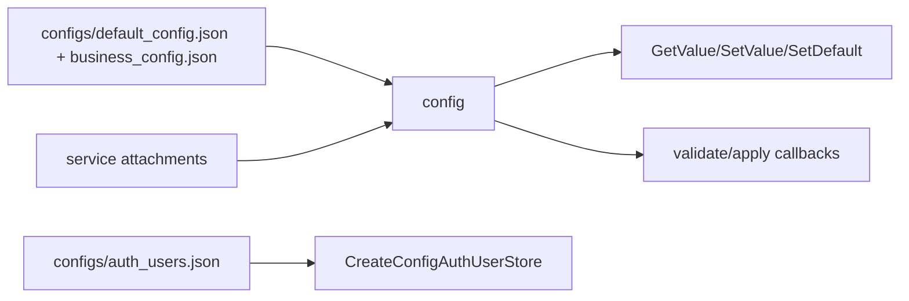

# config

## 命名迁移

本模块命名迁移遵循仓库根目录 `重构.md` 的“任务 1 命名迁移基线”。后续目录、静态库、public header、接口类、Options/Dependencies/Stats、工厂函数和变量名只按该基线迁移；本文件中的旧 `_service`、`stream_*`、`MetaRtc*` 或 `Yang*` 名称仅表示迁移前名称、历史说明或明确允许保留的协议概念。HTTP REST 路径、配置 schema、Web DTO 和 ONVIF 返回路径可以随完全重构同步迁移；变更必须在同一任务内更新调用方、配置样例和文档，不保留旧兼容适配。

## 模块定位

`config` 是全局配置中心，负责加载、保存、默认值、配置 scope 的
validate/apply attachment，以及认证用户存储适配。业务配置语义由拥有模块定义，
`config` 负责配置生命周期和原子应用边界。

## 总体框架图

## 核心职责

- 启动时加载默认配置和业务配置。
- 为每个 scope 提供 `GetValue`、`SetValue`、`GetDefault`、`SetDefault`。
- 通过 `ConfigAttachment` 先 validate 再 apply，失败时拒绝配置变更。
- 提供 `CreateConfigAuthUserStore()` 给 `auth` 持久化认证用户。

## 接口归属

public API 在 `libs/config/include/config.h`。配置字段正文归对应
模块文档，例如 video/image 归 `device_media`，overlay 归 `region`，
AI 归 `ai`，network 归 `network_config`，snapshot 归 `snapshot`。

配置 scope 归属：

| scope | 语义归属 | 说明 |
| --- | --- | --- |
| `video` / `image` | `device_media` | 视频编码、ISP 图像策略和能力应用 |
| `overlay` | `region` | OSD、隐私遮挡和坐标合法性 |
| `ai` | `ai` | AI 开关、后端、模型、阈值和告警联动 |
| `network` | `network_config` | 网口、DHCP/static、DNS、端口展示 |
| `snapshot` | `snapshot` | 抓图开关、路径、质量和超时 |
| `rtsp` / `webrtc` / `onvif` / `http` | 对应协议模块 | 协议开关、监听端口、认证和会话上限 |
| `time` / `system` / `alarm` / `log` | 对应设备或基础模块 | 设备管理、告警和日志运行配置 |
| `audio` | `CoreSubsystem` 守卫 | 兼容字段，只允许 disabled |
| `user` | `auth` + `CreateConfigAuthUserStore` | 认证用户和密码策略存储 |

`config` 只保证 JSON 加载、默认值、scope 原子替换和 validate/apply 调用顺序。
字段枚举值、取值范围、热应用失败回滚策略和 HTTP DTO 映射都归拥有模块。
`webrtc.public_ip` 缺省、为空或为 `"auto"` 时，运行时由 app 按
`network.default_ifname` 读取设备当前 IPv4；显式 IPv4 仍作为多网卡、NAT 或端口映射
场景的手动覆盖值。

`ProtocolSubsystem` 为 `http`、`rtsp`、`webrtc` 和 `onvif` scope 安装运行态
attachment。`SetValue` 成功代表对应协议运行态已经应用；会重绑 listener、端口、
executor 或连接上限的字段在运行时直接拒绝保存并要求重启，不能落盘成“看似成功但
未生效”的状态。

## 产品范围守卫

`CoreSubsystem` 会为 `audio` scope 安装守卫，允许 disabled 兼容字段存在，但拒绝
启用音频。其他不支持范围也应由拥有模块或组合根守卫处理。

## 状态与资源模型

运行配置来自 `configs/default_config.json` 和 `configs/business_config.json`，认证用户
来自 `configs/auth_users.json`。`SetValue` 成功必须代表 validate 和 apply 都成功；
失败时调用方不能把 Web 保存状态当作硬件运行态。配置服务不缓存 SDK 句柄，也不直接
启动或停止业务资源。

## 风险与优化方向

- 配置字段含义必须向后兼容。
- HTTP、Web DTO 和拥有模块配置应用必须同步，避免保存成功但运行态未应用。
- `network` scope 当前只能由 `network_config` 挂载一个 attachment；协议层依赖
  `network.advertise_ip` 或自动 WebRTC IP 的运行态联动，需要后续改成事件订阅或
  多 attachment 机制，不能抢占 `network_config` 的平台应用回调。
- 不要在 `config` 中加入设备 SDK 解析或前端 DTO 逻辑。
