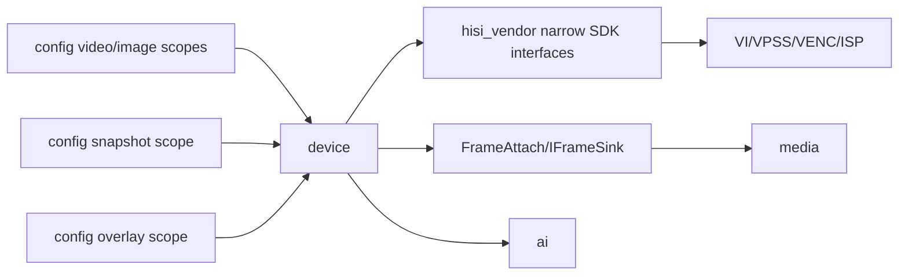

# device

## 命名迁移

本模块命名迁移遵循`docs/refactor/README.md` 的命名规则。后续目录、静态库、public header、接口类、Options/Stats、工厂函数和变量名只按该基线迁移；本文件中的旧 `_service`、`stream_*`、`MetaRtc*` 或 `Yang*` 名称仅表示迁移前名称、历史说明或明确允许保留的协议概念。HTTP REST 路径、配置 schema、Web DTO 和 ONVIF 返回路径可以随完全重构同步迁移；变更必须在同一任务内更新调用方、配置样例和文档，不保留旧兼容适配。

## 模块定位

`device` 拥有设备侧视频 pipeline 生命周期、主/子码流启动停止、MPP/VENC/ISP
适配、编码帧输出、抓图、OSD/隐私遮挡、关键帧请求和视频/图像配置应用。它只面向
`media` 输出设备编码帧，不拥有 RTSP、HTTP、WebRTC、HLS/FLV 请求解析、
协议缓存、socket 发送队列或 Web Console DTO。

## 总体框架图

## 核心职责

- 启动和停止视频 pipeline。
- 维护 stream 是否启动、codec、capabilities、channels。
- 对外提供 `AttachFrameSink`、`DetachFrameSink`、`RequestKeyframe`。
- 读取和应用 snapshot 配置，通过 `CaptureSnapshot()` 提供 JPEG 抓图。
- 校验和应用 overlay 配置，管理 text OSD、隐私遮挡和 SDK region 生命周期。
- 通过内部 `MediaPipeline` 管理 MPP/VI/VPSS/VENC 生命周期；该私有类不是
  `media` 模块，也不参与协议分发。
- 应用 video/image 配置，并通过 SDK 控制 ISP、VENC 和相关媒体资源。
- 提供 `ImageInfo` 供 HTTP/Web 展示图像策略运行状态。

## 接口归属

public API 在 `device.h`：

- `DeviceMedia`
- `DeviceMediaOptions`
- `SnapshotRequest`、`SnapshotFrame`、`SnapshotInfo`
- overlay/region DTO 和 `OverlayInfo`
- `ImageInfo`
- `CreateDeviceMedia`

HTTP `/api/config/video`、`/api/config/image`、`/api/config/snapshot` 和
`/api/config/overlay` 的业务配置语义归本模块，DTO 转换归 `http`，Web 表单归
`www`。`/snapshot/{stream}.jpg` 的 HTTP route 归 `http`，抓图能力和配置应用归
`device`。

配置字段归属：

| scope | 字段组 | 归属说明 |
| --- | --- | --- |
| `video.streams.<main/sub>` | `enabled`、`codec`、`resolution`、`fps`、`bitrate_kbps` | VENC 通道和码流能力应用 |
| `video.streams.<main/sub>` | `rate_control`、`gop`、`gop_mode`、`smart_codec` | 编码控制和 HiSilicon SmartP/GOP 映射 |
| `video.streams.<main/sub>.roi` | `enabled`、`regions[]`、`qp`、`absolute_qp` | VENC ROI 编码区域和 QP 策略 |
| `image.basic` | brightness、contrast、saturation、sharpness、hue | ISP/CSC 基础图像控制 |
| `image.exposure` | mode、anti_flicker、exposure_time、gain、compensation、slow_shutter、max_exposure_time | AE/曝光策略 |
| `image.white_balance` / `image.enhancement` | white balance、denoise、gamma、defog | ISP 图像增强 |
| `image.backlight` / `image.orientation` / `image.color_mode` / `image.strategy` | 背光、镜像翻转、彩黑模式、自动图像策略 | 运行时图像策略和状态展示 |
| `image.lens_correction` | `enabled`、`aspect`、视角 ratio、中心偏移、畸变强度 | VPSS LDC 镜头畸变校正 |
| `image.stabilization` | `enabled`、运动等级、裁剪比例、缓冲帧数、漂移限制 | VI DIS 电子防抖 |
| `snapshot` | `enabled`、`jpeg_quality`、`timeout_ms` | JPEG 抓图开关、质量和超时 |
| `overlay` | text OSD、font、privacy_masks | OSD、隐私遮挡和坐标合法性 |

默认视频配置面向清晰预览：主码流为 1080P/30fps，子码流为
720P/30fps/3072kbps，GOP 为 30 帧以降低 WebRTC、HLS 和 HTTP-FLV 首播等待。
默认图像策略为 `low_noise`，按 IMX290 的低照特性使用较低
锐度、温和 2D/3D 降噪和 3DNR 上限，避免 ISP 手动锐化放大点状噪声或过度发蜡。

`image.strategy` 默认启用，支持可选调参与无停机联调：

- `enabled`: `boolean`，策略开关。
- `mode`: `balanced|low_noise|detail`。
- `fallback_exposure_time_divisor`: `uint32`，曝光时间兜底估算因子，默认 `100`。
- `gain_base`: `uint32`，用于增益归一化分母，默认 `1024`（`0x400`）。
- `iso_tier_thresholds`: 长度为 3 的 `uint32[]`，用于分档阈值，默认 `[400, 1600, 6400]`。
- `low_noise_denoise_3d_max`: 长度为 4 的 `uint32[]`，`low_noise` 档位 0~3 的 3D 降噪上限。
- `tier_stability_samples`: `int32`，档位切换所需连续采样次数（1~10），默认 `2`。

`ImageInfo` 运行态会返回策略抖动观测值：

- `requested_tier`：当前曝光下最近一次计算的目标档位（`day` / `indoor` / `low_light` /
  `very_low_light`）。
- `pending_tier`：若目标档位与当前稳定档位不一致，正在等待确认中的候选档位；否则为空。
- `pending_tier_hits`：当前候选档位已连续观测到的次数。
- `tier_stability_samples`：当前 `strategy.tier_stability_samples` 生效值。

Hi3516DV300 VENC 支持 H.264、H.265、MJPEG 和 JPEG。`video.streams.<main/sub>.codec`
用于实时主/子码流，暴露 H.264、H.265 和 MJPEG；JPEG 只用于 snapshot 抓图输出。

ROI 编码只改变 VENC 码率/QP 分配，不裁剪画面，也不改变协议输出分辨率。当前配置
每路最多 8 个区域，坐标使用该码流分辨率下的像素坐标。`absolute_qp=false` 时
`qp` 是相对 QP，负值提高区域画质；`absolute_qp=true` 时 `qp` 是绝对 QP。ROI 只对
H.264/H.265 生效，JPEG/MJPEG 配置 ROI 会被拒绝。

镜头畸变校正通过 VPSS LDC 下发到主/子码流输出通道。`enabled=false` 时关闭校正；
开启后 `aspect=true` 使用 `xy_ratio` 保持横纵一致，`aspect=false` 分别使用
`x_ratio`、`y_ratio`；`distortion_ratio` 范围为 -300..500，中心偏移范围为
-511..511。该功能只改变几何映射，不改变编码协议或码流分辨率。

电子防抖通过 VI 通道 DIS 下发，当前只支持无陀螺仪的 GME 模式。`enabled=false`
时关闭 DIS；开启后要求当前主码流和启用的子码流都不小于硬件最小尺寸
1280x720。DIS 会按 `crop_ratio` 预留稳定裁剪边界，可能改变有效视场，但不改变
编码协议或配置中的输出分辨率。

字段新增或枚举变化必须同步 `http` DTO、`www/src/api/types.ts` 和
`www/README.md`。保存成功不能只代表 JSON 写入成功，还必须代表配置已经通过本模块
verify/apply。

## 状态与资源模型

HiSilicon SDK 契约归 `hisi_vendor`，`device` 只消费 `hisi_vendor/sdk.h`、
`hisi_vendor/media_pipeline.h`、`hisi_vendor/mpp_types.h` 和
`hisi_vendor/media_capabilities.h`。host SDK 仅作为 `device/src` 内部实现存在，
不进入 public SDK 契约。

`device` 是最接近硬件 pipeline 的状态拥有者。帧订阅是跨模块边界，订阅方
不能持有 SDK 内部资源，也不能在帧路径打普通诊断日志。`device` 只转发编码帧并
提供关键帧请求入口；新订阅方 keyframe-first、GOP、HLS、FLV、MJPEG ready、
时间戳修正和协议订阅缓存归 `media` 主链路。关键帧请求必须通过
`RequestKeyframe` 进入媒体模块。

`media/media_buffer.h` 提供基础 `MediaOutSlice`，只表达一段待发送数据和可选
`MediaBuffer` owner。HTTP/FLV/MJPEG/HLS 等协议边界可以直接提交 slice，异步发送时
由拥有 socket 队列的模块保留 owner 引用；`device` 不因此持有协议状态。

抓图和 overlay 都是设备资源的内部子能力。组合根不再创建独立 snapshot 或 region
对象；`DeviceMedia::Start()` 在硬件 pipeline 可用后启动抓图配置和 overlay 应用，
`DeviceMedia::Stop()` / 配置重建会先释放 OSD、隐私遮挡和抓图访问，再停止或重建
MPP channel。抓图失败返回空 `SnapshotFrame`，不影响实时预览主链路；overlay 热应用
失败必须清理半创建 region，避免遮挡残留。

`DeviceImpl` 只作为 `DeviceMedia` 的具体门面和编排层。内部职责按资源边界拆分：
`DeviceFeatures` 拥有抓图和 overlay 资源，`ConfigScopes` 管理 video/image 配置 scope
注册，`ImageTuner` 拥有自动图像调节线程和 `ImageInfo`，`PipelineChange` 负责视频
配置热应用、MPP 重建和失败恢复。设备运行阶段使用 `DevicePhase`，不在门面类中继续
堆叠 snapshot、overlay、配置注册、图像调节和 pipeline 回滚状态。

## 参考项目检查点

`my_video` 证明配置、抓图、OSD、预览切换和协议输出叠加后，风险会从 sample 初始化转移到
运行期生命周期。`device` 后续优化按以下检查点收敛：

- 启动阶段只编排设备业务和 SDK 窄接口，不把 RTSP、HTTP-FLV、WebRTC 或 Web DTO 引入
  `device`。
- 视频、图像、抓图和 overlay 配置保存必须表示本模块已经 verify/apply 成功；失败时
  返回明确 scope/field/reason。视频 pipeline 热应用失败应尽量恢复旧运行态；恢复失败
  必须进入 failed/stopped 等明确状态，不能报告为已应用。
- pipeline 重建期间，抓图、overlay 热应用、AI 抓帧和关键帧请求必须看到明确的
  device phase，不能继续访问正在释放或重建的 MPP 资源。
- 抓图失败、AI 抓帧失败或 overlay 应用失败只影响对应能力；实时预览主链路不能因此被
  错误停止，除非底层 pipeline 本身已经失败。
- Web 所展示的“已生效”和“待生效”状态必须来自后端字段；`device` 不能依赖前端重推导
  SDK 状态来补偿后端状态不清。

## 音视频专项边界

产品只支持视频。旧配置文件中的音频字段只做升级兼容忽略；不启动音频采集、编码、
传输或 UI/API。HiSilicon 静态库中的音频符号由 `hisi_vendor` 失败符号闭合。

## 风险与优化方向

- 帧路径避免多余拷贝、频繁分配和日志。
- 配置热应用失败必须保留可解释状态，避免 Web 保存状态和硬件运行态不一致。
- MPP/VENC/ISP 结构转换留在 `hisi_vendor`，不要扩散到 HTTP 或 Web。
- snapshot/overlay 不再有独立模块边界，不新增 `snapshot.h`、`region.h` 或 `osd.h`
  public header。
