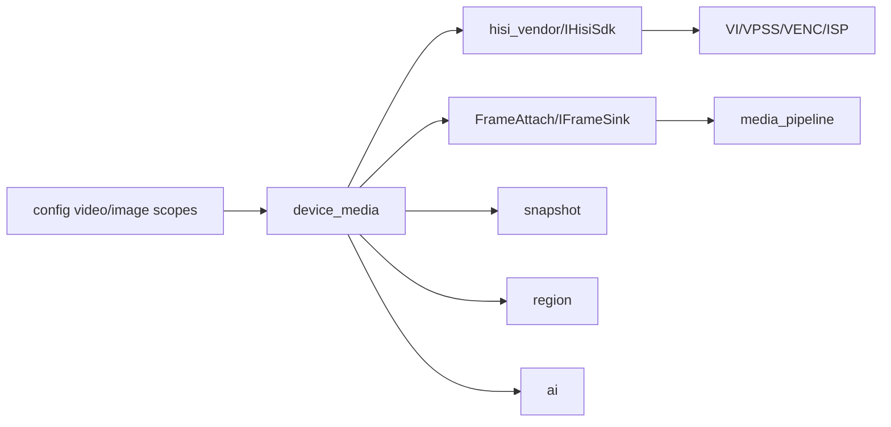

# device_media

## 命名迁移

本模块命名迁移遵循仓库根目录 `重构.md` 的“任务 1 命名迁移基线”。后续目录、静态库、public header、接口类、Options/Dependencies/Stats、工厂函数和变量名只按该基线迁移；本文件中的旧 `_service`、`stream_*`、`MetaRtc*` 或 `Yang*` 名称仅表示迁移前名称、历史说明或明确允许保留的协议概念。HTTP REST 路径、配置 schema、Web DTO 和 ONVIF 返回路径可以随完全重构同步迁移；变更必须在同一任务内更新调用方、配置样例和文档，不保留旧兼容适配。

## 模块定位

`device_media` 拥有设备侧视频 pipeline 生命周期、主/子码流启动停止、MPP/VENC/ISP
适配、编码帧输出、抓图来源、关键帧请求和视频/图像配置应用。它只面向
`media_pipeline` 输出设备编码帧，不拥有 RTSP、HTTP、WebRTC、HLS/FLV 请求解析、
协议缓存、socket 发送队列或 Web Console DTO。

## 总体框架图

## 核心职责

- 启动和停止视频 pipeline。
- 维护 stream 是否启动、codec、capabilities、channels。
- 对外提供 `AttachFrameSink`、`DetachFrameSink`、`RequestKeyFrame`。
- 通过内部 `DeviceMediaPipeline` 管理 MPP/VI/VPSS/VENC 生命周期；该私有类不是
  `media_pipeline` 模块，也不参与协议分发。
- 应用 video/image 配置，并通过 SDK 控制 ISP、VENC 和相关媒体资源。
- 提供 `ImageStrategyStatus` 供 HTTP/Web 展示图像策略运行状态。

## 接口归属

public API 在 `device_media.h`：

- `IDeviceMedia`
- `DeviceMediaOptions`
- `ImageStrategyStatus`
- `CreateDeviceMedia`

HTTP `/api/config/video`、`/api/config/image` 的业务配置语义归本模块，DTO 转换归
`http`，Web 表单归 `www`。

配置字段归属：

| scope | 字段组 | 归属说明 |
| --- | --- | --- |
| `video.streams.<main/sub>` | `enabled`、`codec`、`resolution`、`fps`、`bitrate_kbps` | VENC 通道和码流能力应用 |
| `video.streams.<main/sub>` | `rate_control`、`gop`、`gop_mode`、`smart_codec` | 编码控制和 HiSilicon SmartP/GOP 映射 |
| `image.basic` | brightness、contrast、saturation、sharpness、hue | ISP/CSC 基础图像控制 |
| `image.exposure` | mode、anti_flicker、exposure_time、gain、compensation、slow_shutter、max_exposure_time | AE/曝光策略 |
| `image.white_balance` / `image.enhancement` | white balance、denoise、gamma、defog | ISP 图像增强 |
| `image.backlight` / `image.orientation` / `image.color_mode` / `image.strategy` | 背光、镜像翻转、彩黑模式、自动图像策略 | 运行时图像策略和状态展示 |

默认视频配置面向清晰预览：主码流为 1080P/30fps，子码流为
720P/30fps/3072kbps，GOP 为 30 帧以降低 WebRTC、HLS 和 HTTP-FLV 首播等待。
默认图像策略为 `low_noise`，按 IMX290 的低照特性使用较低
锐度、温和 2D/3D 降噪和 3DNR 上限，避免 ISP 手动锐化放大点状噪声或过度发蜡。

字段新增或枚举变化必须同步 `http` DTO、`www/src/api/types.ts` 和
`www/README.md`。保存成功不能只代表 JSON 写入成功，还必须代表配置已经通过本模块
validate/apply。

## 状态与资源模型

`device_media` 是最接近硬件 pipeline 的状态拥有者。帧订阅是跨模块边界，订阅方
不能持有 SDK 内部资源，也不能在帧路径打普通诊断日志。`device_media` 只缓存设备
订阅所需的最近关键帧，用于新订阅方 keyframe-first 启动；GOP、HLS、FLV、MJPEG
ready、时间戳修正和协议 reader 缓存归 `media_source`/`media_pipeline` 主链路。
关键帧请求必须通过 `RequestKeyFrame` 进入媒体模块。

`media/media_buffer.h` 提供基础 `MediaSlice`，只表达一段待发送数据和可选
`VideoBuffer` owner。HTTP/FLV/MJPEG/HLS 等协议边界可以直接提交 slice，异步发送时
由拥有 socket 队列的模块保留 owner 引用；`device_media` 不因此持有协议状态。

## 音视频专项边界

产品只支持视频。旧配置文件中的音频字段只做升级兼容忽略；不启动音频采集、编码、
传输或 UI/API。HiSilicon 静态库中的音频符号由 `hisi_vendor` 失败 stub 闭合。

## 风险与优化方向

- 帧路径避免多余拷贝、频繁分配和日志。
- 配置热应用失败必须回滚或明确报告错误，避免 Web 保存状态和硬件运行态不一致。
- MPP/VENC/ISP 结构转换留在 `hisi_vendor`，不要扩散到 HTTP 或 Web。
