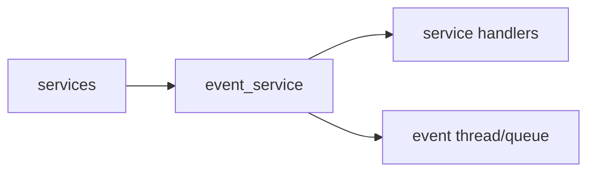

# event_service Design

## 模块定位

`event_service` 是进程内轻量发布订阅服务。它承载状态变化和控制元信息，不承载
媒体帧、二进制 payload、凭据或大 JSON。

## 总体框架图

## 核心职责

- 提供 `Subscribe`、`Unsubscribe`、`Publish`。
- 通过 event thread 异步调用 handler。
- 统一事件类型和轻量 payload 字段：`source`、`target`、`message`、`value`。

## 接口归属

public API 在 `event_service.h`。事件 payload 归 `event_service` 文档维护：

| EventType | source | target | message | value |
| --- | --- | --- | --- | ---: |
| `kConfigChanged` | 发布模块 | 配置 scope | 可读变更说明 | 保留为 0 |
| `kMediaPipelineStarted` / `kMediaPipelineStopped` | `media_service` | stream 或 pipeline | 状态说明 | 保留为 0 |
| `kMediaPipelineError` | `media_service` | stream 或 pipeline | 错误原因 | 错误码或 0 |
| `kStreamStarted` / `kStreamStopped` | 码流拥有模块 | `main` / `sub` | 状态说明 | 保留为 0 |
| `kRtspClientConnected` / `kRtspClientDisconnected` | `rtsp_service` | session/client id | 客户端地址或原因 | 活跃数或 0 |
| `kWebRtcClientConnected` / `kWebRtcClientDisconnected` | `webrtc_service` | peer id | 状态说明 | 活跃数或 0 |
| `kOnvifRequestReceived` | `onvif_service` | action/path | 请求摘要 | 保留为 0 |
| `kSnapshotCreated` | `snapshot_service` | stream | 输出摘要 | 字节数或 0 |
| `kTimeChanged` | `time_service` | timezone/ntp/manual | 变更摘要 | 保留为 0 |
| `kNetworkChanged` | `network_service` | interface 或 port | 变更摘要 | 保留为 0 |
| `kAlarmTriggered` | `alarm_service` | alarm type | 告警摘要 | 严重度或 0 |
| `kSystemStatusChanged` | `system_service` | status key | 状态摘要 | 状态码或 0 |
| `kUpgradeProgressChanged` | `upgrade_service` | upgrade job/stage | 阶段或错误说明 | 进度百分比或 0 |

payload 只承载轻量元数据。媒体帧、图片、升级包、凭据、HTTP body、大 JSON 和指针不能
通过 event payload 传递；需要详细数据时，subscriber 应通过拥有模块的查询接口读取。

## 非目标

- 不作为跨模块 RPC、任务队列或可靠消息总线。
- 不保证进程退出后的事件持久化。
- 不承载高频媒体帧或大对象生命周期。

## 状态与资源模型

handler 必须轻量。需要耗时业务时，subscriber 应投递到自己的任务队列，不能阻塞
event thread。
