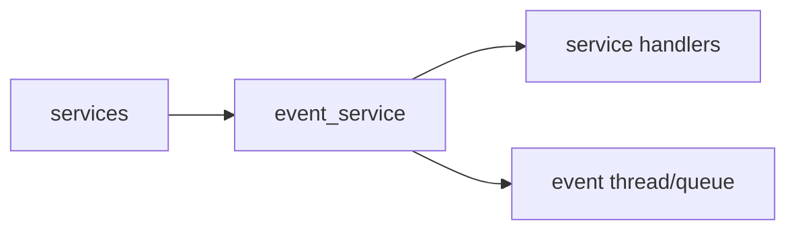

# event_service Design

## 模块定位

`event_service` 是进程内轻量发布订阅服务。它承载状态变化和控制元信息，不承载
媒体帧、二进制 payload、凭据或大 JSON。

## 总体框架图

## 核心职责

- 提供 `Subscribe`、`Unsubscribe`、`Publish`。
- 通过 event thread 异步调用 handler。
- 统一事件类型和轻量 payload 字段：`source`、`target`、`message`、`value`。

## 接口归属

public API 在 `event_service.h`。事件 payload 归 `event_service` 文档维护：

| EventType | 用途 |
| --- | --- |
| `kConfigChanged` | 配置 scope 变更 |
| `kMediaPipelineStarted` / `kMediaPipelineStopped` / `kMediaPipelineError` | 媒体 pipeline 生命周期 |
| `kStreamStarted` / `kStreamStopped` | 码流运行状态 |
| `kRtspClientConnected` / `kRtspClientDisconnected` | RTSP session 生命周期 |
| `kWebRtcClientConnected` / `kWebRtcClientDisconnected` | WebRTC peer 生命周期 |
| `kOnvifRequestReceived` | ONVIF 请求观察点 |
| `kSnapshotCreated` | 抓图创建 |
| `kTimeChanged` / `kNetworkChanged` | 设备配置变化 |
| `kAlarmTriggered` | 告警触发 |
| `kSystemStatusChanged` | 系统状态变化 |
| `kUpgradeProgressChanged` | 升级状态变化 |

## 状态与资源模型

handler 必须轻量。需要耗时业务时，subscriber 应投递到自己的任务队列，不能阻塞
event thread。
