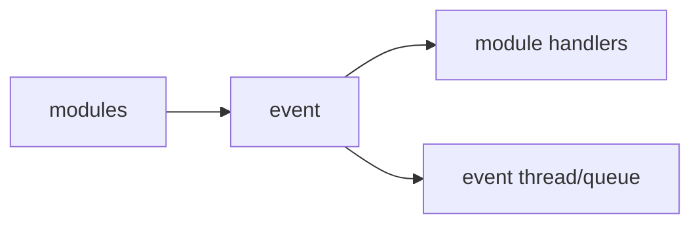

# event

## 命名迁移

本模块命名迁移遵循`docs/refactor/README.md` 的命名规则。后续目录、静态库、public header、接口类、Options/Dependencies/Stats、工厂函数和变量名只按该基线迁移；本文件中的旧 `_service`、`stream_*`、`MetaRtc*` 或 `Yang*` 名称仅表示迁移前名称、历史说明或明确允许保留的协议概念。HTTP REST 路径、配置 schema、Web DTO 和 ONVIF 返回路径可以随完全重构同步迁移；变更必须在同一任务内更新调用方、配置样例和文档，不保留旧兼容适配。

## 模块定位

`event` 是进程内轻量发布订阅服务。它承载状态变化和控制元信息，不承载
媒体帧、二进制 payload、凭据或大 JSON。

## 总体框架图

## 核心职责

- 提供多事件类型 `Subscribe`、`Unsubscribe`、`Publish` 和 `GetCounts`。
- 通过 event thread 异步调用 handler。
- 统一事件类型和轻量 payload 字段：`source`、`target`、`message`、`value`、
  `timestamp_ms`、`level`。

## 接口归属

public API 在 `event.h`。事件 payload 归 `event` 文档维护：

| EventType | source | target | message | value |
| --- | --- | --- | --- | ---: |
| `kConfigChanged` | 发布模块 | 配置 scope | 可读变更说明 | 保留为 0 |
| `kMediaPipelineStarted` / `kMediaPipelineStopped` | `device` | stream 或 pipeline | 状态说明 | 保留为 0 |
| `kMediaPipelineError` | `device` | stream 或 pipeline | 错误原因 | 错误码或 0 |
| `kMediaStatusChanged` | `media` | `{main,sub}.ready/frame` | `changed` / `first` | ready 状态位或保留为 1 |
| `kStreamStarted` / `kStreamStopped` | 码流拥有模块 | `main` / `sub` | 状态说明 | 保留为 0 |
| `kRtspClientConnected` / `kRtspClientDisconnected` | `rtsp` | session/client id | 客户端地址或原因 | 活跃数或 0 |
| `kWebRtcClientConnected` / `kWebRtcClientDisconnected` | `webrtc` | peer id | 状态说明 | 活跃数或 0 |
| `kOnvifRequestReceived` | `onvif` | action/path | 请求摘要 | 保留为 0 |
| `kSnapshotCreated` | `device` | stream | 输出摘要 | 字节数或 0 |
| `kTimeChanged` | `time` | timezone/ntp/manual | 变更摘要 | 保留为 0 |
| `kNetworkChanged` | `system.network` | interface 或 port | 变更摘要 | 保留为 0 |
| `kAlarmOn` / `kAlarmOff` | `alarm` | alarm type | 告警摘要 | 告警值或 0 |
| `kSystemStatusChanged` | `system` | status key | 状态摘要 | 状态码或 0 |
| `kUpgradeProgressChanged` | `upgrade` | upgrade job/stage | 阶段或错误说明 | 进度百分比或 0 |

payload 只承载轻量元数据。媒体帧、图片、升级包、凭据、HTTP body、大 JSON 和指针不能
通过 event payload 传递；需要详细数据时，handler 应通过拥有模块的查询接口读取。

## 非目标

- 不作为跨模块 RPC、任务队列或可靠消息总线。
- 不保证进程退出后的事件持久化。
- 不承载高频媒体帧或大对象生命周期。

## 状态与资源模型

handler 必须轻量。需要耗时业务时，handler 应投递到自己的任务队列，不能阻塞
event thread。

`EventCounts` 使用通俗计数字段描述事件库负载：`published`、`handled`、
`dropped`、`rejected`、`queued`。队列满时 `Publish` 返回 `false`，并递增
`dropped` 和 `rejected`，优先保护实时路径。
