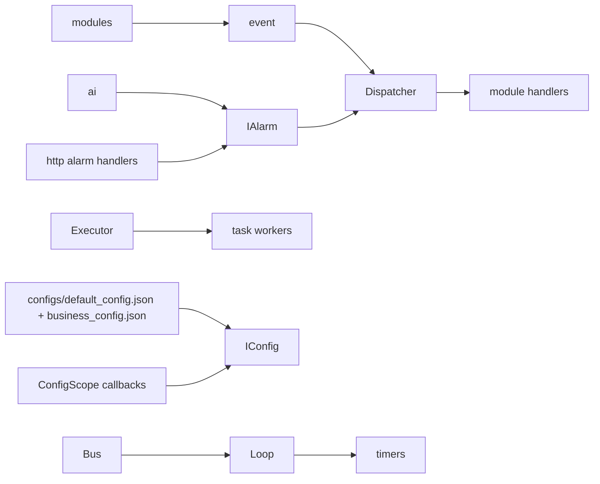

# event

## 命名迁移

本模块命名迁移遵循`docs/refactor/README.md` 的命名规则。后续目录、静态库、public header、接口类、Options/Dependencies/Stats、工厂函数和变量名只按该基线迁移；本文件中的旧 `_service`、`stream_*`、`MetaRtc*` 或 `Yang*` 名称仅表示迁移前名称、历史说明或明确允许保留的协议概念。HTTP REST 路径、配置 schema、Web DTO 和 ONVIF 返回路径可以随完全重构同步迁移；变更必须在同一任务内更新调用方、配置样例和文档，不保留旧兼容适配。

## 模块定位

`event` 是进程内控制平面基础库。它承载轻量状态变化、控制元信息、普通异步任务、
低频 timer、全局配置中心和轻量告警状态，不承载媒体帧、二进制 payload、凭据或大 JSON。

## 总体框架图

## 核心职责

- 提供 `Dispatcher::Subscribe`、`SubscribeTypes`、RAII `Subscription`、
  `Publish` 和 `GetCounts`。
- 提供 `Bus` 组合 `Loop + Dispatcher`，用于异步发布事件。
- 提供 `Executor` 执行普通后台任务，供 AI、升级等低频后台流程复用。
- 提供 `Loop::Post`、`RunAfter`、`RunEvery` 和 `CancelTimer`，供 net 和协议模块
  绑定任务/timer 生命周期。
- 提供 `IConfig` 配置中心，负责加载、保存、默认值、scope 原子替换和
  `ConfigScope` verify/apply 调用顺序。
- 提供 `IAlarm` 轻量告警状态中心，负责告警规则、输入、当前状态、
  `kAlarmOn` / `kAlarmOff` 发布和操作日志记录。
- 统一事件类型和轻量 payload 字段：`source`、`target`、`message`、`value`、
  `timestamp_ms`、`level`。

## 接口归属

public API 在 `libs/event/include/`。事件 dispatch 入口是 `event.h`，任务执行入口是
`executor.h`，loop/timer 入口是 `loop.h`，配置中心入口保留为 `config.h`，
告警入口保留为 `alarm.h`。事件 payload 归 `event` 文档维护：

| EventType | source | target | message | value |
| --- | --- | --- | --- | ---: |
| `kConfigChanged` | 发布模块 | 配置 scope | 可读变更说明 | 保留为 0 |
| `kMediaPipelineStarted` / `kMediaPipelineStopped` | `device` | stream 或 pipeline | 状态说明 | 保留为 0 |
| `kMediaPipelineError` | `device` | stream 或 pipeline | 错误原因 | 错误码或 0 |
| `kMediaStatusChanged` | `media` | `{main,sub}.ready/frame` | `changed` / `first` | ready 状态位或保留为 1 |
| `kStreamStarted` / `kStreamStopped` | 码流拥有模块 | `main` / `sub` | 状态说明 | 保留为 0 |
| `kRtspClientConnected` / `kRtspClientDisconnected` | `rtsp` | session/client id | 客户端地址或原因 | 活跃数或 0 |
| `kWebRtcClientConnected` / `kWebRtcClientDisconnected` | `webrtc` | peer id | 状态说明 | 活跃数或 0 |
| `kOnvifRequestReceived` | `onvif` | action/path | 请求摘要 | 保留为 0 |
| `kSnapshotCreated` | `device` | stream | 输出摘要 | 字节数或 0 |
| `kTimeChanged` | `time` | timezone/ntp/manual | 变更摘要 | 保留为 0 |
| `kNetworkChanged` | `system.network` | interface 或 port | 变更摘要 | 保留为 0 |
| `kNetPressureChanged` | `net_stat` | `connections` | 压力等级摘要 | tracked target 数 |
| `kAlarmOn` / `kAlarmOff` | `alarm` | alarm type | 告警摘要 | 告警值或 0 |
| `kSystemInfoChanged` | `system` | info key | 信息摘要 | 状态码或 0 |
| `kUpgradeProgressChanged` | `upgrade` | upgrade job/stage | 阶段或错误说明 | 进度百分比或 0 |

payload 只承载轻量元数据。媒体帧、图片、升级包、凭据、HTTP body、大 JSON 和指针不能
通过 event payload 传递；需要详细数据时，handler 应通过拥有模块的查询接口读取。

`config.h` 的 public API 名称保持 `IConfig`、`ConfigOptions`、`ConfigScope`、
`CreateConfig()`。配置字段正文归对应模块文档，例如 video/image、overlay 和 snapshot
归 `device`，AI 归 `ai`，network 归 `system.network`。`event` 只保证 JSON 加载、
默认值、scope 原子替换和 verify/apply 调用顺序。

`alarm.h` 的 public API 名称保持 `IAlarm`、`AlarmOptions`、`AlarmRule`、
`AlarmInfo`、`CreateAlarm()`。AI 告警图片归 `ai`，告警规则和触发状态归 `event`
内的 alarm 功能。HTTP 路由由 `http` 实现，业务状态来自 `IAlarm`。

## 非目标

- 不作为跨模块 RPC、任务队列或可靠消息总线。
- 不保证进程退出后的事件持久化。
- 不承载高频媒体帧或大对象生命周期。
- 不解析设备 SDK 配置语义，不拥有 HTTP/Web DTO 映射。
- 不实现录像、回放、云推送或长期告警归档。

## 状态与资源模型

handler 必须轻量。需要耗时业务时，handler 应投递到自己的任务队列，不能阻塞
发布线程或 event loop。

`Dispatcher::Publish()` 是同步调用，返回 `EventStatus`；需要跨线程异步事件时使用
`Bus::PublishAsync()` 或 `Dispatcher::Post(loop, event)`。`Loop` 和 `Executor`
队列满时返回 `EventStatus::kQueueFull`，调用方必须按业务语义丢弃、重试或降级。

`EventStats` 使用 `published`、`handled`、`rejected` 和 `subscriptions` 描述事件库负载。

运行配置来自 `configs/default_config.json` 和 `configs/business_config.json`。
`IConfig::Set` 成功必须代表 verify、apply 和保存都成功；保存失败会调用
`apply(now, prev)` 回滚运行态，并恢复内存中的旧值。

告警状态是轻量内存状态，不是录像索引或长期存储。AI 启用时只注入
`AlarmSource::kAiDetection`，不启用录像、回放或长期保存。AI 告警规则未启用时，
AI 仍可保存抓拍图片，但不会发布 `kAlarmOn` 系统告警事件。
