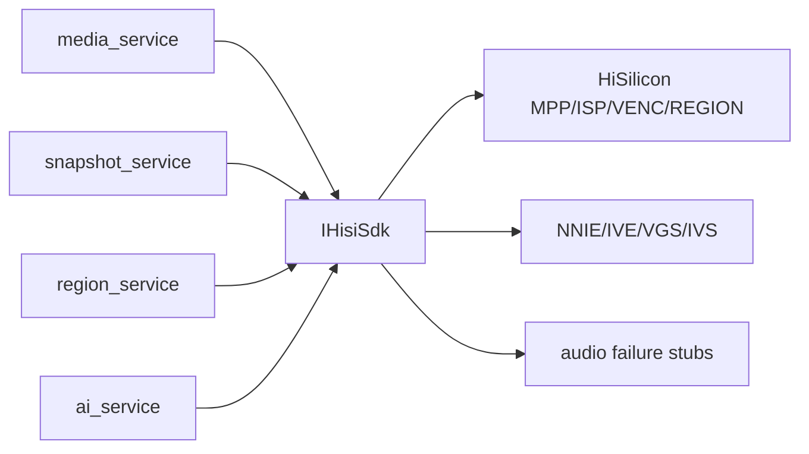

# hisi_vendor Design

## 模块定位

`hisi_vendor` 是 HiSilicon MPP/VENC/ISP/REGION/SNAPSHOT/NNIE/IVE/VGS SDK 边界。
它把海思 MPI/API 结构和调用封装在项目内，向上提供 `hisisdk::IHisiSdk`。

## 总体框架图

## 核心职责

- 封装 MPP system、VI、VPSS、VENC、ISP、snapshot 和 region 调用。
- 提供媒体 capabilities 和 HiSilicon-specific channel 信息。
- 提供 AI 所需的 NNIE/IVE/VGS/IVS 能力边界。
- 用失败 stub 闭合海思 `libmpi.a` 内部音频符号，不启用音频能力。

## 接口归属

public SDK interface 位于 `hisi_vendor` include 和 `mpp_hisi_sdk_impl` 相关实现。
上层模块不直接包含海思 MPI 业务结构；需要新增硬件能力时先扩展 `IHisiSdk`。

## 非目标

- 不拥有 HTTP DTO。
- 不拥有 Web 配置字段。
- 不拥有业务策略，例如 AI 阈值、overlay 配置语义或视频码流策略。

## 风险与优化方向

- SDK 调用失败必须返回明确错误，不应在上层造成半启动资源。
- 硬件资源 create/destroy 顺序必须和 MPP 要求一致。
- 音频相关 stub 只能失败返回，不能形成隐式音频支持。
