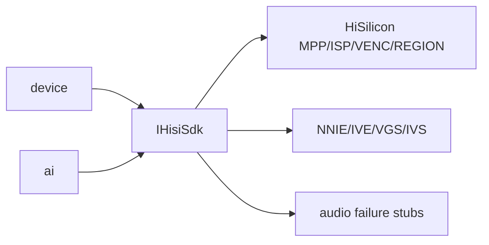

# hisi_vendor

## 命名迁移

本模块命名迁移遵循`docs/refactor/README.md` 的命名规则。后续目录、静态库、public header、接口类、Options/Dependencies/Stats、工厂函数和变量名只按该基线迁移；本文件中的旧 `_service`、`stream_*`、`MetaRtc*` 或 `Yang*` 名称仅表示迁移前名称、历史说明或明确允许保留的协议概念。HTTP REST 路径、配置 schema、Web DTO 和 ONVIF 返回路径可以随完全重构同步迁移；变更必须在同一任务内更新调用方、配置样例和文档，不保留旧兼容适配。

## 模块定位

`hisi_vendor` 是 HiSilicon MPP/VENC/ISP/REGION/SNAPSHOT/NNIE/IVE/VGS SDK 边界。
它把海思 MPI/API 结构和调用封装在项目内，向上提供 `hisisdk::IHisiSdk`。

## 总体框架图

## 核心职责

- 封装 MPP system、VI、VPSS、VENC、ISP、snapshot 和 region 调用。
- 提供媒体 capabilities 和 HiSilicon-specific channel 信息。
- 提供 AI 所需的 NNIE/IVE/VGS/IVS 能力边界。
- 用失败 stub 闭合海思 `libmpi.a` 内部音频符号，不启用音频能力。

## 接口归属

public SDK interface 位于 `hisi_vendor` include 和 `mpp_hisi_sdk_impl` 相关实现。
上层模块不直接包含海思 MPI 业务结构；需要新增硬件能力时先扩展 `IHisiSdk`。

## 状态与资源模型

硬件资源生命周期必须由调用方通过 `IHisiSdk` 明确 create/start/stop/destroy。
`hisi_vendor` 可以保存 SDK 适配所需的句柄和能力缓存，但不能替业务模块决定配置策略、
Web DTO 或运行状态展示。
VPSS group 启动时启用视频降噪，参数保持和海思示例工程一致：
`VPSS_NR_TYPE_VIDEO`、`NR_MOTION_MODE_NORMAL`、`COMPRESS_MODE_FRAME`。ISP 画质控制仍由
`device` 的 image 配置和自动图像策略决定。IMX290 普通模式保留 RAW12/非 WDR
链路，ISP sharpen 映射只调 texture/edge 强度并降低 edge 上限，保留当前频率和
overshoot，避免把低照噪声锐化成点状颗粒。
MPP system 清理失败必须 fail fast：`DeinitSystem()` 返回 `false` 时，内部保持
initialized 状态，不把 VB busy、stale resource 或二次清理失败伪装成已清理；调用方
不得继续重建媒体管线。

VENC 封装以 Hi3516 Encode 库为主要参考，保持 `StartVenc -> BindVpssVenc ->
StartVencStream` 的上层调用契约，但模块内部按每路 VENC state 记录 channel、
VPSS 绑定、接收状态和 codec。失败回滚和停止顺序必须遵循创建的反向路径：
停止取流线程、停止接收、解绑 VPSS、销毁 VENC channel。
VENC ROI 使用 `HI_MPI_VENC_SetRoiAttrEx`，创建 VENC channel 后应用所有 ROI slot；
未使用的 slot 必须显式关闭，避免旧区域残留。上层只传项目内 `VideoRoiConfig`，
不直接暴露海思 `VENC_ROI_ATTR_EX_S`。
镜头畸变校正使用 VPSS 通道级 `HI_MPI_VPSS_SetChnLDCAttr`，同一组
`image.lens_correction` 参数分别应用到主码流和已启用的子码流 VPSS channel；
当前 Hi3516DV300/CV500 路径使用通用 `VPSS_LDC_ATTR_S`，不使用标注为 EV200 的
VPSS LDCV3 接口。
电子防抖使用 VI 通道级 `HI_MPI_VI_SetChnDISConfig` 和
`HI_MPI_VI_SetChnDISAttr`。Hi3516CV500/DV300 的 ISP DIS 接口不支持本芯片路径，
所以本模块只接 VI DIS；当前配置固定使用 IPC 产品类型和无陀螺仪 GME 模式，不暴露
gyro/hybrid DIS 承诺。

JPEG 抓图保持同步 `CaptureJpeg` 接口，底层使用 VPSS 取帧后送入独立 JPEG VENC
channel，再按 `GetStream/ReleaseStream` 成对读取编码结果。抓图控制语义借鉴 Capture
库的抓图请求和状态边界，但不引入 Capture 的 task、Binder 或共享内存通信模型；
抓图必须串行执行，不能复用主/子码流 VENC channel，也不能破坏实时预览码流。

## 非目标

- 不拥有 HTTP DTO。
- 不拥有 Web 配置字段。
- 不拥有业务策略，例如 AI 阈值、overlay 配置语义或视频码流策略。

## 风险与优化方向

- SDK 调用失败必须返回明确错误，不应在上层造成半启动资源。
- 硬件资源 create/destroy 顺序必须和 MPP 要求一致。
- 音频相关 stub 只能失败返回，不能形成隐式音频支持。
