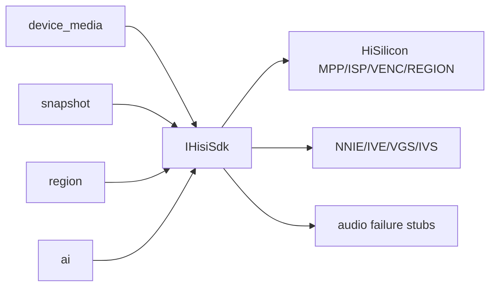

# hisi_vendor

## 命名迁移

本模块命名迁移遵循仓库根目录 `重构.md` 的“任务 1 命名迁移基线”。后续目录、静态库、public header、接口类、Options/Dependencies/Stats、工厂函数和变量名只按该基线迁移；本文件中的旧 `_service`、`stream_*`、`MetaRtc*` 或 `Yang*` 名称仅表示迁移前名称、历史说明或明确允许保留的协议概念。HTTP REST 路径、配置 schema、Web DTO 和 ONVIF 返回路径可以随完全重构同步迁移；变更必须在同一任务内更新调用方、配置样例和文档，不保留旧兼容适配。

## 模块定位

`hisi_vendor` 是 HiSilicon MPP/VENC/ISP/REGION/SNAPSHOT/NNIE/IVE/VGS SDK 边界。
它把海思 MPI/API 结构和调用封装在项目内，向上提供 `hisisdk::IHisiSdk`。

## 总体框架图

## 核心职责

- 封装 MPP system、VI、VPSS、VENC、ISP、snapshot 和 region 调用。
- 提供媒体 capabilities 和 HiSilicon-specific channel 信息。
- 提供 AI 所需的 NNIE/IVE/VGS/IVS 能力边界。
- 用失败 stub 闭合海思 `libmpi.a` 内部音频符号，不启用音频能力。

## 接口归属

public SDK interface 位于 `hisi_vendor` include 和 `mpp_hisi_sdk_impl` 相关实现。
上层模块不直接包含海思 MPI 业务结构；需要新增硬件能力时先扩展 `IHisiSdk`。

## 状态与资源模型

硬件资源生命周期必须由调用方通过 `IHisiSdk` 明确 create/start/stop/destroy。
`hisi_vendor` 可以保存 SDK 适配所需的句柄和能力缓存，但不能替业务模块决定配置策略、
Web DTO 或运行状态展示。
VPSS group 启动时启用视频降噪，参数保持和海思示例工程一致：
`VPSS_NR_TYPE_VIDEO`、`NR_MOTION_MODE_NORMAL`、`COMPRESS_MODE_FRAME`。ISP 画质控制仍由
`device_media` 的 image 配置和自动图像策略决定。
MPP system 清理失败必须 fail fast：`DeinitSystem()` 返回 `false` 时，内部保持
initialized 状态，不把 VB busy、stale resource 或二次清理失败伪装成已清理；调用方
不得继续重建媒体管线。

## 非目标

- 不拥有 HTTP DTO。
- 不拥有 Web 配置字段。
- 不拥有业务策略，例如 AI 阈值、overlay 配置语义或视频码流策略。

## 风险与优化方向

- SDK 调用失败必须返回明确错误，不应在上层造成半启动资源。
- 硬件资源 create/destroy 顺序必须和 MPP 要求一致。
- 音频相关 stub 只能失败返回，不能形成隐式音频支持。
