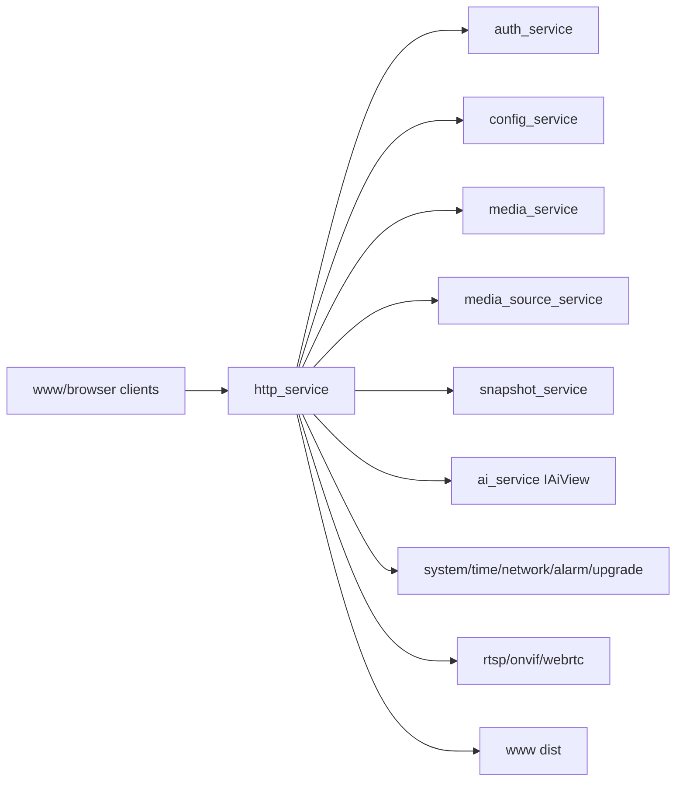

# http_service Design

## 模块定位

`http_service` 是 Web Console 和浏览器预览的 HTTP 边界。它拥有 HTTP server、
request parsing、认证边界、路由分发、DTO 转换、静态 UI 文件服务以及 HLS/FLV/
MJPEG/snapshot/WebRTC signaling 的 HTTP 入口。

## 总体框架图

## 核心职责

- 处理 HTTP 连接、keep-alive、request timeout、body size 和静态文件。
- 执行认证和权限检查。
- 按业务域注册 handlers：auth、config、media、snapshot、stream、AI、system、
  network、time、upgrade、operations、WebRTC。
- 做 DTO 转换，不拥有业务状态。
- 为 HLS、HTTP-FLV、MJPEG 和 snapshot 提供流式响应。

## API 归属

HTTP 路由由本模块实现，但业务语义归拥有模块：

| API 组 | 业务归属 |
| --- | --- |
| `/api/auth/*` | `auth_service` |
| `/api/config/video`, `/api/config/image` | `media_service` |
| `/api/config/overlay` | `region_service` |
| `/api/config/network` | `network_service` |
| `/api/config/snapshot` | `snapshot_service` |
| `/api/config/ai`, `/api/ai/*` | `ai_service` |
| `/api/media/capabilities` | `media_service` |
| `/api/status/streams`, `/api/hls/*`, `/api/flv/*`, `/api/mjpeg/*` | `media_source` / `media_source_service` |
| `/api/snapshot/*` | `snapshot_service` |
| `/api/system/status` | `system_service` |
| `/api/upgrade/*` | `upgrade_service` |
| `/api/operations*` | `logger_service` |
| `/api/webrtc/*` | `webrtc_service` |

## 状态与资源模型

HTTP 是最宽依赖模块。宽依赖只允许停留在 HTTP 边界，不允许业务模块反向依赖 HTTP
或 Web。流式响应使用 stream/control executor，避免控制 API 被直播写阻塞。

HTTP 自有资源只包括 listener、connection、request/response buffer、router、
executor、静态文件句柄和认证中间态。业务对象生命周期、配置状态、媒体 ready 状态和
升级状态都必须从拥有模块读取。

`HttpServiceOptions` 的资源上限是 HTTP 边界契约：`max_connections`、
`max_request_header_bytes`、`max_request_body_bytes`、`send_queue_capacity`、
`send_buffer_limit_bytes`、`stream_executor_*`、`control_executor_*` 和 timeout 字段
用于限制慢客户端、上传体和流式响应对进程内存的影响。

## 非目标

- 不在 HTTP 层推导媒体、升级、AI 或设备运行状态。
- 不把 Web DTO 反向扩散到业务模块。
- 不让直播 socket 写持有媒体源内部锁。

## 风险与优化方向

- `HttpServiceDependencies` 较宽，后续可把 handlers 变成独立构造的 handler 类。
- 流式接口必须处理慢客户端和断连，不能持有媒体内部锁长时间写 socket。
- DTO 字段变更必须同步 Web API 类型和拥有模块文档。
