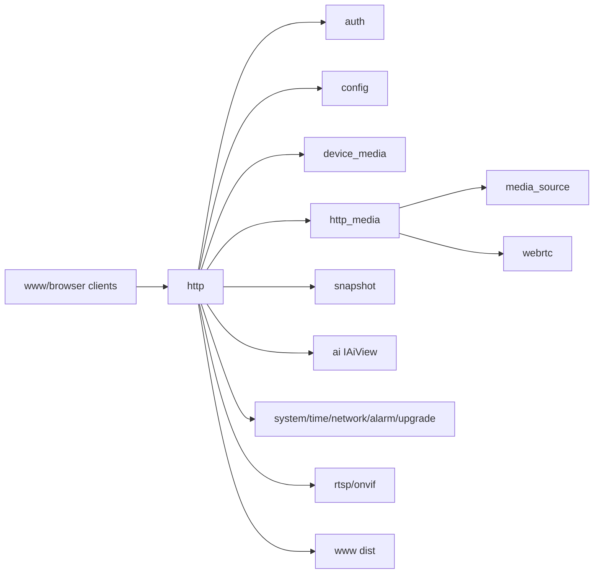

# http

## 命名迁移

本模块命名迁移遵循仓库根目录 `重构.md` 的“任务 1 命名迁移基线”。后续目录、静态库、public header、接口类、Options/Dependencies/Stats、工厂函数和变量名只按该基线迁移；本文件中的旧 `_service`、`stream_*`、`MetaRtc*` 或 `Yang*` 名称仅表示迁移前名称、历史说明或明确允许保留的协议概念。HTTP REST 路径、配置 schema、Web DTO 和 ONVIF 返回路径可以随完全重构同步迁移；变更必须在同一任务内更新调用方、配置样例和文档，不保留旧兼容适配。

## 模块定位

`http` 是 Web Console 的普通 HTTP 边界。它拥有 HTTP server、request parsing、
认证边界、路由分发、控制 API DTO 转换和静态 UI 文件服务。HLS、HTTP-FLV、MJPEG
和 WebRTC signaling 的实现类归 `http_media`，由 `http` 在启动时注册到同一个
router。

## 总体框架图

## 核心职责

- 处理 HTTP 连接、keep-alive、request timeout、body size 和静态文件。
- 执行认证和权限检查。
- 按业务域注册 handlers：auth、config、media、snapshot、AI、system、
  network、time、upgrade、operations，以及 `http_media` 提供的媒体 handlers。
- 做 DTO 转换，不拥有业务状态。
- 通过 `HttpMediaWriter` 向 `http_media` 提供长连接写入、断连回调和发送队列边界。

## API 契约

HTTP 路由由本模块实现，但业务语义归拥有模块。第二阶段重构冻结后的 JSON API
不保留旧路径 alias；媒体播放 URL 与 JSON API 分离。

| API 组 | 业务归属 |
| --- | --- |
| `/api/auth/*` | `auth` |
| `/api/config/*` | `device_media`、`region`、`network_config`、`snapshot`、`ai` |
| `/api/media/streams` | `media_source` / `device_media` |
| `/api/media/capabilities` | `device_media` |
| `/api/media/streams/{stream}` | `media_source` / `device_media` |
| `/api/media/streams/{stream}/urls` | `http` URL helper + `http_media` / `rtsp` / `snapshot` |
| `/api/media/sessions` | `http_media`、`rtsp`、`webrtc`、`net` diagnostics |
| `/api/status/image-strategy` | `device_media` |
| `/api/webrtc/peers` | `http_media` / `webrtc` |
| `/api/webrtc/peers/{peer_id}/offer` | `http_media` / `webrtc` |
| `/api/webrtc/peers/{peer_id}/candidates` | `http_media` / `webrtc` |
| `/api/webrtc/peers/{peer_id}` | `http_media` / `webrtc` |
| `/api/system/*` | `system`、`time`、`network_config` |
| `/api/system/time/*` | `time` |
| `/api/system/network/*` | `network_config` |
| `/api/upgrade/*` | `upgrade` |
| `/api/operations*` | `logger` |
| `/api/ai/*` | `ai` |

所有 JSON API 统一响应 envelope：

| 字段 | 语义 |
| --- | --- |
| `ok` | `true` 表示请求成功，`false` 表示失败。 |
| `data` | 成功时的业务数据；无返回数据时为对象或 `null`，由具体 API 固定。 |
| `error` | 失败对象，成功时为 `null`。 |
| `request_id` | 本次请求 id，日志和前端错误提示都使用同一值。 |

`error.code` 冻结为小写蛇形命名：`invalid_argument`、`unauthenticated`、
`permission_denied`、`stream_not_found`、`protocol_unavailable`、`peer_not_found`、
`resource_busy`、`internal_error`。`error.message` 是给 Web 展示和运维排查的短文本。

`stream` 路径参数只允许 `main` 或 `sub`。HTTP 内部可以把它映射到 `live/main`、
`live/sub` 或模块内部枚举，但不得把 `vhost/app`、旧 `stream_*` 字段或设备 SDK
细节暴露给 Web。

播放 URL 由 `GET /api/media/streams/{stream}/urls` 返回：

| 字段 | URL 规则 | 归属 |
| --- | --- | --- |
| `hls` | `/live/{stream}/hls/index.m3u8` | `http_media` |
| `http_flv` | `/live/{stream}.live.flv` | `http_media` |
| `mjpeg` | `/live/{stream}.mjpg` | `http_media` |
| `snapshot` | `/snapshot/{stream}.jpg` | `snapshot` |
| `rtsp` | 后端按 Host、RTSP 端口、认证配置生成完整 URL | `rtsp` / `http` helper |
| `webrtc_whep` | `/live/{stream}/whep`，可选 | `http_media` / `webrtc` |

`/snapshot/{stream}.jpg`、`/live/*` 和 WHEP SDP 路径是播放/二进制媒体入口，
不返回 JSON envelope；它们仍由 HTTP 路由鉴权和资源上限保护。
浏览器侧访问这些媒体入口、AI 告警图片和 `/api/operations/export` 时依赖
登录接口下发的 `HttpOnly` session cookie；JSON API 仍可使用 `Authorization:
Bearer` header。Web 不在 URL query 中携带 access token。

## 状态与资源模型

HTTP 是较宽依赖模块。宽依赖只允许停留在 HTTP 边界，不允许业务模块反向依赖 HTTP
或 Web。媒体长连接使用 stream/control executor 分流，避免控制 API 被直播写阻塞。
`CreateHttp()` 通过 `HttpDependencies` 命名字段接收 app 组合根注入，
避免认证、设备、协议和媒体源依赖靠长参数位置传递。
handler 和 router 注册只在 `HttpImpl` 构造期内部完成，不提供运行期重配入口。

HTTP 自有资源只包括 listener、connection、request/response buffer、router、
executor、静态文件句柄、认证中间态和 `HttpMediaWriter` 会话句柄。业务对象生命周期、
配置状态、媒体 ready 状态和升级状态都必须从拥有模块读取。

`HttpOptions` 的资源上限是 HTTP 边界契约：`max_connections`、
`max_request_header_bytes`、`max_request_body_bytes`、`send_queue_capacity`、
`send_buffer_limit_bytes`、`stream_executor_*`、`control_executor_*` 和 timeout 字段
用于限制慢客户端、上传体和流式响应对进程内存的影响。

`http.port` 和 `http.static_root` 属于 HTTP listener/static file 运行态边界。当前
阶段 app 为 `http` scope 安装 config attachment，运行时修改会被拒绝，避免配置落盘
成功但当前 HTTP 服务仍使用旧端口或旧静态目录；需要重启后生效。

## 非目标

- 不在 HTTP 层推导媒体、升级、AI 或设备运行状态。
- 不把 Web DTO 反向扩散到业务模块。
- 不让直播 socket 写持有媒体源内部锁。
- 不在 `http` 内实现 HLS、HTTP-FLV、MJPEG 或 WebRTC signaling 业务逻辑。

## 风险与优化方向

- `HttpDependencies` 较宽，后续可把控制 handlers 变成独立构造的 handler 类。
- `HttpMediaWriter` 必须处理慢客户端和断连，不能持有媒体内部锁长时间写 socket。
- DTO 字段变更必须同步 Web API 类型和拥有模块文档。
