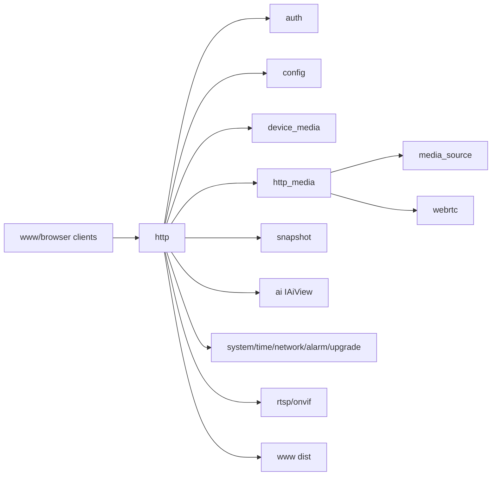

# http

## 命名迁移

本模块命名迁移遵循仓库根目录 `重构.md` 的“任务 1 命名迁移基线”。后续目录、静态库、public header、接口类、Options/Dependencies/Stats、工厂函数和变量名只按该基线迁移；本文件中的旧 `_service`、`stream_*`、`MetaRtc*` 或 `Yang*` 名称仅表示迁移前名称、历史说明或明确允许保留的协议概念。HTTP REST 路径、配置 schema、Web DTO 和 ONVIF 返回路径可以随完全重构同步迁移；变更必须在同一任务内更新调用方、配置样例和文档，不保留旧兼容适配。

## 模块定位

`http` 是 Web Console 的普通 HTTP 边界。它拥有 HTTP server、request parsing、
认证边界、路由分发、控制 API DTO 转换和静态 UI 文件服务。HLS、HTTP-FLV、MJPEG
和 WebRTC signaling 的实现类归 `http_media`，由 `http` 在启动时注册到同一个
router。

## 总体框架图

## 核心职责

- 处理 HTTP 连接、keep-alive、request timeout、body size 和静态文件。
- 执行认证和权限检查。
- 按业务域注册 handlers：auth、config、media/status、snapshot、AI、system、
  network、time、upgrade、operations，以及 `http_media` 提供的媒体 handlers。
- 做 DTO 转换，不拥有业务状态。
- 通过 `HttpMediaWriter` 向 `http_media` 提供长连接写入、断连回调和发送队列边界。

## API 归属

HTTP 路由由本模块实现，但业务语义归拥有模块：

| API 组 | 业务归属 |
| --- | --- |
| `/api/auth/*` | `auth` |
| `/api/config/video`, `/api/config/image` | `device_media` |
| `/api/config/overlay` | `region` |
| `/api/config/network` | `network_config` |
| `/api/config/snapshot` | `snapshot` |
| `/api/config/ai`, `/api/ai/*` | `ai` |
| `/api/media/capabilities` | `device_media` |
| `/api/status/streams` | `media_source` / `device_media` |
| `/api/hls/*`, `/api/flv/*`, `/api/mjpeg/*` | `http_media` / `media_source` |
| `/api/snapshot/*` | `snapshot` |
| `/api/system/status` | `system` |
| `/api/upgrade/*` | `upgrade` |
| `/api/operations*` | `logger` |
| `/api/webrtc/*` | `http_media` / `webrtc` |

## 状态与资源模型

HTTP 是较宽依赖模块。宽依赖只允许停留在 HTTP 边界，不允许业务模块反向依赖 HTTP
或 Web。媒体长连接使用 stream/control executor 分流，避免控制 API 被直播写阻塞。

HTTP 自有资源只包括 listener、connection、request/response buffer、router、
executor、静态文件句柄、认证中间态和 `HttpMediaWriter` 会话句柄。业务对象生命周期、
配置状态、媒体 ready 状态和升级状态都必须从拥有模块读取。

`HttpOptions` 的资源上限是 HTTP 边界契约：`max_connections`、
`max_request_header_bytes`、`max_request_body_bytes`、`send_queue_capacity`、
`send_buffer_limit_bytes`、`stream_executor_*`、`control_executor_*` 和 timeout 字段
用于限制慢客户端、上传体和流式响应对进程内存的影响。

## 非目标

- 不在 HTTP 层推导媒体、升级、AI 或设备运行状态。
- 不把 Web DTO 反向扩散到业务模块。
- 不让直播 socket 写持有媒体源内部锁。
- 不在 `http` 内实现 HLS、HTTP-FLV、MJPEG 或 WebRTC signaling 业务逻辑。

## 风险与优化方向

- `HttpDependencies` 较宽，后续可把控制 handlers 变成独立构造的 handler 类。
- `HttpMediaWriter` 必须处理慢客户端和断连，不能持有媒体内部锁长时间写 socket。
- DTO 字段变更必须同步 Web API 类型和拥有模块文档。
