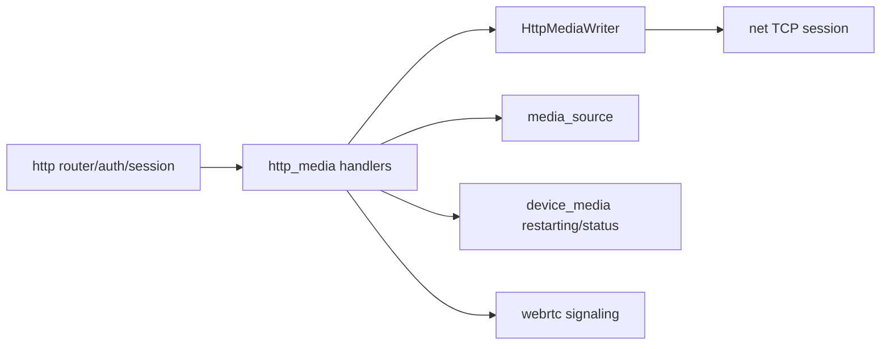

# http_media

## 模块定位

`http_media` 是 HTTP 媒体入口模块，负责 HLS、HTTP-FLV、MJPEG 和 WebRTC signaling
等与浏览器预览相关的 HTTP 媒体输出。普通控制 API、认证和静态资源仍归 `http`。
当前任务 7 拆分保持既有 REST 路径和 DTO 不变，Web Console 不需要因为模块拆分调整
调用路径。

## 总体框架图

## 设计目标与非目标

- 通过 `media_source` 的 HLS/FLV/MJPEG public API 获取媒体数据，通过 `http` 提供的
  `HttpMediaWriter` 输出长连接数据。
- REST 路径或 DTO 变更时同步迁移 `www/` 的 API client、mock 数据、类型定义和页面调用；
  本次拆分未改变路径或 DTO。
- 不拥有设备编码入口、GOP cache、私有 socket 队列或 WebRTC ICE/DTLS/SRTP 状态。
- 不保留旧 REST route alias 或旧 DTO 适配层。

## 核心职责

- HLS playlist/segment HTTP 输出，路径保持 `/api/hls/{stream}/...`。
- HTTP-FLV 长连接输出。
- MJPEG 输出。
- WebRTC signaling HTTP DTO 转换和鉴权入口。
- 媒体长连接的慢客户端断开、reader detach 和资源回落验收。

## 依赖边界

- 依赖 `http` 的路由、认证边界、`IHttpHandler` 和 `HttpMediaWriter`。
- 依赖 `media_source` 的 HLS segment/playlist、HTTP-FLV start data/client、MJPEG client
  和 reader/client count。
- 间接依赖 `net` 的 session、send queue、buffer limit 和 close callback；socket 生命周期
  仍由 `http` server 持有。
- 依赖 `webrtc` 的 native signaling/session public API，但不持有 transport 状态。

## API 归属

| API | 实现归属 |
| --- | --- |
| `GET /api/hls/{stream}/index.m3u8` | `http_media` HLS handler |
| `GET /api/hls/{stream}/seg-{sequence}.ts` | `http_media` streaming handler |
| `GET /api/flv/{stream}.flv` | `http_media` HTTP-FLV handler |
| `GET /api/mjpeg/{stream}.mjpg` | `http_media` MJPEG handler |
| `POST /api/webrtc/*`, `DELETE /api/webrtc/close` | `http_media` WebRTC signaling handler |
