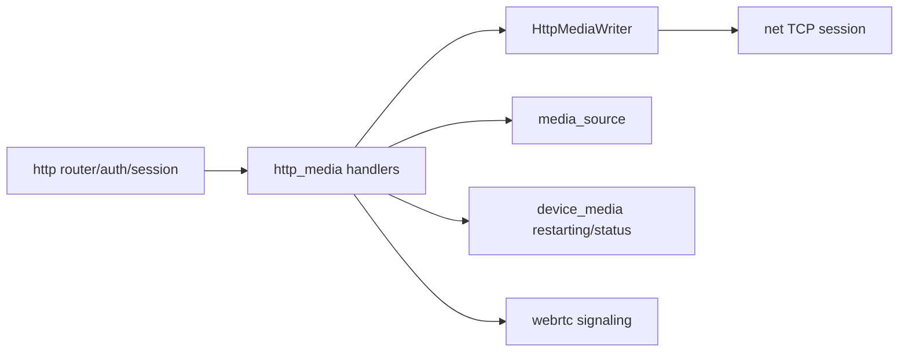

# http_media

## 模块定位

`http_media` 是 HTTP 媒体入口模块，负责 HLS、HTTP-FLV、MJPEG 和 WebRTC signaling
等与浏览器预览相关的 HTTP 媒体输出。普通控制 API、认证和静态资源仍归 `http`。
第二阶段重构后，媒体播放 URL 使用 `/live/*` 和 `/snapshot/*`，控制面 JSON API
使用 `/api/*` envelope；本模块不保留旧 `/api/hls`、`/api/flv`、`/api/mjpeg`
或旧 WebRTC signaling alias。

## 总体框架图

## 设计目标与非目标

- 通过 `media_source` 的 HLS/FLV/MJPEG public API 获取媒体数据，通过 `http` 提供的
  `HttpMediaWriter` 输出长连接数据。
- REST 路径或 DTO 变更时同步迁移 `www/` 的 API client、mock 数据、类型定义和页面调用；
  本阶段冻结新路径和 DTO，不保留旧路径适配。
- 不拥有设备编码入口、GOP cache、私有 socket 队列或 WebRTC ICE/DTLS/SRTP 状态。
- 不保留旧 REST route alias 或旧 DTO 适配层。

## 核心职责

- HLS playlist/segment HTTP 输出，路径为 `/live/{stream}/hls/...`。
- HTTP-FLV 长连接输出。
- MJPEG 输出。
- WebRTC RESTful signaling 和可选 WHEP HTTP 入口的 DTO 转换和鉴权。
- 媒体长连接的慢客户端断开、reader detach 和资源回落验收。

## 依赖边界

- 依赖 `http` 的路由、认证边界、`IHttpHandler` 和 `HttpMediaWriter`。
- 依赖 `media_source` 的 HLS segment/playlist、HTTP-FLV start data/client、MJPEG client
  和 reader/client count。
- 间接依赖 `net` 的 session、send queue、buffer limit 和 close callback；socket 生命周期
  仍由 `http` server 持有。
- 依赖 `webrtc` 的 native signaling/session public API，但不持有 transport 状态。

媒体正文输出统一使用 `MediaSlice` 表达 header、payload 和可选 `VideoBuffer`
owner。HLS segment、HTTP-FLV cached GOP 和 MJPEG frame 只提交 slice；跨线程或异步
TCP 发送期间的 payload 生命周期由 HTTP writer/net send queue 按 owner 引用保持。

## API 归属

| API | 实现归属 |
| --- | --- |
| `GET /live/{stream}/hls/index.m3u8` | `http_media` HLS playlist handler |
| `GET /live/{stream}/hls/seg-{sequence}.ts` | `http_media` HLS segment handler |
| `GET /live/{stream}.live.flv` | `http_media` HTTP-FLV handler |
| `GET /live/{stream}.mjpg` | `http_media` MJPEG handler |
| `POST /live/{stream}/whep` | 可选 WHEP handler，body/response 都是 SDP |
| `DELETE /live/{stream}/whep/{peer_id}` | 可选 WHEP close handler |
| `POST /api/webrtc/peers` | `http_media` WebRTC create peer JSON handler |
| `POST /api/webrtc/peers/{peer_id}/offer` | `http_media` WebRTC offer JSON handler |
| `POST /api/webrtc/peers/{peer_id}/candidates` | `http_media` WebRTC candidate JSON handler |
| `DELETE /api/webrtc/peers/{peer_id}` | `http_media` WebRTC close JSON handler |

`stream` 只接受 `main` 或 `sub`。HLS、HTTP-FLV、MJPEG 和 WHEP 属于播放 URL，
不包 JSON envelope；失败使用合适 HTTP 状态码和短错误文本。WebRTC JSON signaling
必须返回 `http` 冻结的 `{ ok, data, error, request_id }` envelope。

WebRTC JSON DTO 冻结为：

| DTO | 字段 |
| --- | --- |
| create peer request | `stream`、`client_id`、`session_id` |
| peer response | `peer_id`、`stream`、`state`、`created_at_ms`、`updated_at_ms` |
| offer request | `sdp` |
| offer response | `peer_id`、`state`、`sdp` |
| candidate request | `candidate`、`sdp_mid`、`sdp_mline_index`、`username_fragment` |
| close response | `peer_id`、`state` |

WHEP 成功时返回 `201 Created`、`Content-Type: application/sdp` 和 `Location`；
`Location` 指向对应 DELETE URL。WHEP 失败不返回 JSON envelope。
