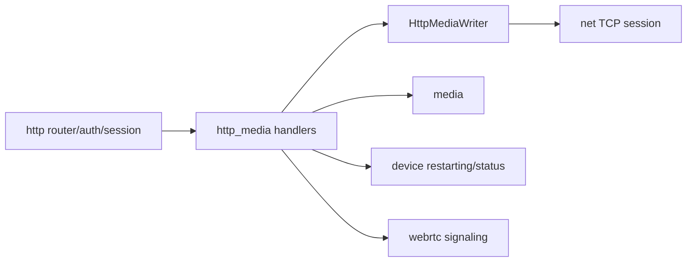

# http_media

## 模块定位

`http_media` 是 HTTP 媒体入口模块，负责 HLS、HTTP-FLV、MJPEG 和 WebRTC signaling
等与浏览器预览相关的 HTTP 媒体输出。普通控制 API、认证和静态资源仍归 `http`。
第二阶段重构后，媒体播放 URL 使用 `/live/*` 和 `/snapshot/*`，控制面 JSON API
使用 `/api/*` envelope；本模块不保留旧 `/api/hls`、`/api/flv`、`/api/mjpeg`
或旧 WebRTC signaling alias。

## 总体框架图

## 设计目标与非目标

- 通过 `media` 的 HLS/FLV/MJPEG public API 获取媒体数据；HLS 作为普通短响应
  返回 `HttpResponse`，HTTP-FLV、MJPEG 和 SSE 通过 `http` 提供的 `HttpMediaWriter`
  输出长连接数据。
- REST 路径或 DTO 变更时同步迁移 `www/` 的 API client、mock 数据、类型定义和页面调用；
  本阶段冻结新路径和 DTO，不保留旧路径适配。
- 不拥有设备编码入口、GOP cache、私有 socket 队列或 WebRTC ICE/DTLS/SRTP 状态。
- 不保留旧 REST route alias 或旧 DTO 适配层。

## 核心职责

- HLS playlist/segment HTTP 输出，路径为 `/live/{stream}/hls/...`。
- HTTP-FLV 长连接输出。
- MJPEG 输出。
- WebRTC RESTful signaling 和可选 WHEP HTTP 入口的 DTO 转换和鉴权。
- 媒体长连接的慢客户端断开、client detach 和资源回落验收。

## 依赖边界

- 依赖 `http` 的路由、认证边界、`IHttpHandler` 和 `HttpMediaWriter`。
- 依赖 `media` 的 HLS segment/playlist、HTTP-FLV start data/client、MJPEG client
  和 subscription/client size。
- 间接依赖 `net` 的 session、send queue、buffer limit 和 close callback；socket 生命周期
  仍由 `http` server 持有。
- 依赖 `webrtc` 的 native signaling/session public API，但不持有 transport 状态。

媒体正文输出统一使用 slice/owner 模型表达 header、payload 和可选 `MediaBuffer`
owner。HLS segment 通过 `HttpResponse.body_slices` 作为普通短响应返回；HTTP-FLV
cached GOP 和 MJPEG frame 通过 `HttpMediaWriter` 提交流式 `MediaOutSlice`。跨线程或异步
TCP 发送期间的 payload 生命周期由 HTTP writer/net send queue 按 owner 引用保持。
HTTP-FLV/MJPEG attach 成功后会把 `HttpMediaClientHandle` 绑定到 HTTP session，
包含 client type、client id 和 stream id；TCP close path 统一 detach media client，
`/api/media/sessions` 也通过这个绑定关系展示 HTTP-FLV/MJPEG 的连接级背压诊断。
会话条目同时补充同 stream 的 `media` 只读状态，包括 running、track ready、
codec/generation、HTTP-FLV/MJPEG ready、last DTS 和 reset reason，便于在同一个
诊断条目里判断是连接慢、媒体未 ready，还是 codec/reset 导致没有新数据。
在调用 `BeginStream(type, stream_id)` 到 `AttachStreamClient()` 完成之间，HTTP session
会以 `stream_state=opening` 暴露，便于定位已接管 TCP 但卡在 header/GOP/sink attach
阶段的连接；attach 成功后变为 `attached`，HTTP 层主动关闭或发送失败后先标记为
`closing`，直到 TCP close callback 完成 detach。SSE 使用同一 close callback 解除
订阅，但不作为媒体会话列入 `/api/media/sessions`。

## API 归属

| API | 实现归属 |
| --- | --- |
| `GET /live/{stream}/hls/index.m3u8` | `http_media` HLS playlist handler |
| `GET /live/{stream}/hls/seg-{sequence}.ts` | `http_media` HLS segment handler |
| `GET /live/{stream}.live.flv` | `http_media` HTTP-FLV handler |
| `GET /live/{stream}.mjpg` | `http_media` MJPEG handler |
| `GET /api/events` | `http_media` SSE event stream |
| `POST /live/{stream}/whep` | 可选 WHEP handler，body/response 都是 SDP |
| `DELETE /live/{stream}/whep/{peer_id}` | 可选 WHEP close handler |
| `POST /api/webrtc/peers` | `http_media` WebRTC create peer JSON handler |
| `POST /api/webrtc/peers/{peer_id}/offer` | `http_media` WebRTC offer JSON handler |
| `POST /api/webrtc/peers/{peer_id}/candidates` | `http_media` WebRTC candidate JSON handler |
| `DELETE /api/webrtc/peers/{peer_id}` | `http_media` WebRTC close JSON handler |

`stream` 只接受 `main` 或 `sub`。HLS、HTTP-FLV、MJPEG、SSE events 和 WHEP 属于
流式/播放 URL，不包 JSON envelope；失败使用合适 HTTP 状态码和短错误文本。WebRTC
JSON signaling 必须返回 `http` 冻结的 `{ ok, data, error, request_id }` envelope。

HTTP streaming handler 必须返回明确的接管结果：`not_handled` 交回普通 router，
`response_sent` 表示接管前错误短响应已经入队，`streaming` 表示连接已经进入长连接状态，
`closed` 表示 handler 已经关闭或安排关闭连接，`failed` 表示 HTTP server 需要关闭
连接。HLS playlist/segment 不进入 streaming handler，FLV/MJPEG/SSE 才会切换 HTTP
session 到 streaming 状态，避免短响应和长连接生命周期混在一起。

WebRTC JSON DTO 冻结为：

| DTO | 字段 |
| --- | --- |
| create peer request | `stream`、`client_id`、`session_id` |
| peer response | `peer_id`、`stream`、`state`、`created_at_ms`、`updated_at_ms` |
| offer request | `sdp` |
| offer response | `peer_id`、`state`、`sdp` |
| candidate request | `candidate`、`sdp_mid`、`sdp_mline_index`、`username_fragment` |
| close response | `peer_id`、`state` |

WebRTC candidate 请求中，空 `candidate` 表示浏览器端候选收集结束，后端返回成功但不写入
WebRTC 核心状态机；非空 `candidate` 必须带有效 `sdp_mline_index`，否则返回 400。

WHEP 成功时返回 `201 Created`、`Content-Type: application/sdp` 和 `Location`；
`Location` 指向对应 DELETE URL。WHEP 失败不返回 JSON envelope。

## 参考项目检查点

参考项目的 Web 预览路径说明，浏览器媒体入口最容易把播放 URL、信令、socket 长连接和设备状态
混在一起。`http_media` 后续实现和 review 按以下检查点执行：

- 播放 URL 只由后端生成并返回给 Web；本模块不保留旧 `/api/hls`、`/api/flv`、
  `/api/mjpeg` 或旧 WebRTC signaling alias。
- HLS 保持短响应模型，HTTP-FLV/MJPEG/SSE 才进入 streaming session；不能把短响应和长连接
  释放路径混用。
- HTTP-FLV/MJPEG attach 成功前后必须能在 session 诊断中区分 `opening`、`attached`、
  `closing`，便于定位卡在 header、GOP、sink attach 还是 socket 发送。
- TCP close、发送失败、HTTP 主动关闭和服务停止都必须走统一 detach 路径，确保 media client
  计数和 buffer 引用回落。
- WebRTC handler 只做 JSON DTO、鉴权和 service 调用，不缓存 ICE/DTLS/SRTP 状态，也不替
  `webrtc` 维护 peer 生命周期。
