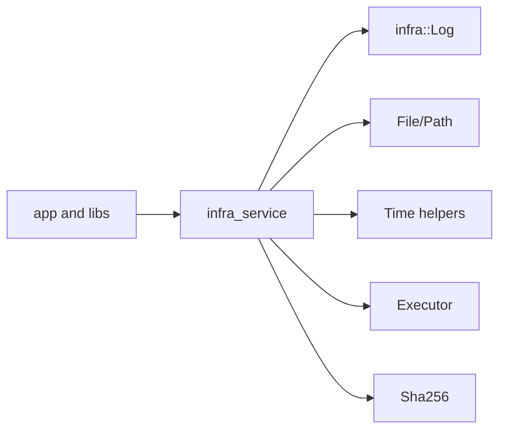

# infra_service Design

## 模块定位

`infra_service` 提供进程级基础设施：日志、文件、路径、时间、哈希和 executor。
它是底层工具模块，不拥有产品业务逻辑、设备 SDK 细节或服务编排。

## 总体框架图

## 核心职责

- 提供常规进程日志入口。
- 提供文件读写、路径和时间工具。
- 提供异步 executor，用于网络 callback 和 HTTP stream/control 任务。
- 提供 hash 能力，供认证、升级或校验路径使用。

## 非目标

- 不记录用户操作日志；操作日志归 `logger_service`。
- 不实现业务状态机。
- 不依赖设备、媒体或协议模块。

## 状态与资源模型

`Executor` 拥有 worker 线程和队列容量。调用方必须在停止阶段选择 discard 或 drain
策略，避免协议关闭时继续访问已释放资源。
