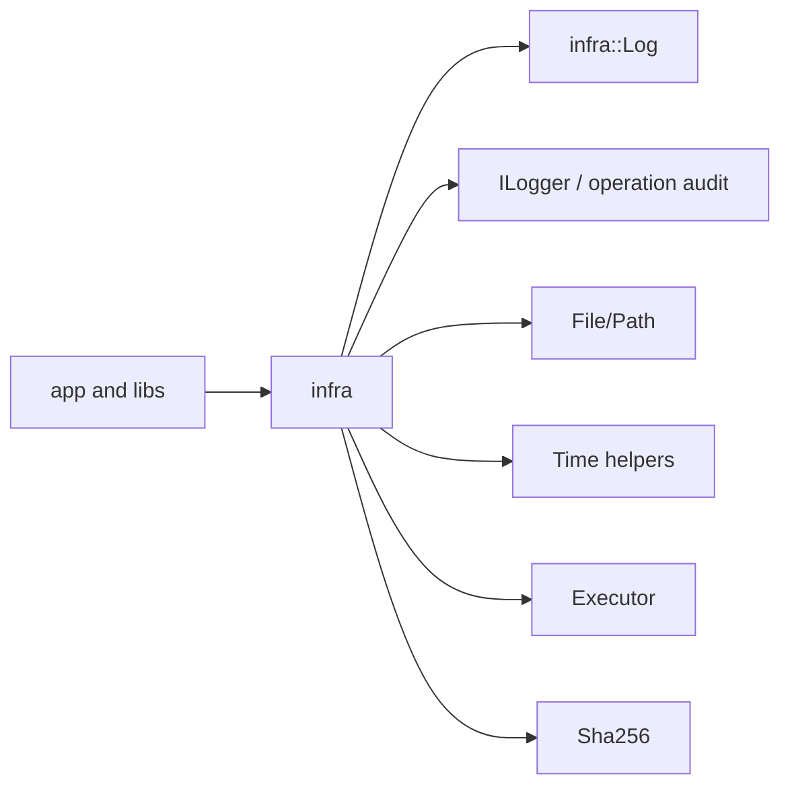

# infra

## 命名迁移

本模块命名迁移遵循`docs/refactor/README.md` 的命名规则。后续目录、静态库、public header、接口类、Options/Dependencies/Stats、工厂函数和变量名只按该基线迁移；本文件中的旧 `_service`、`stream_*`、`MetaRtc*` 或 `Yang*` 名称仅表示迁移前名称、历史说明或明确允许保留的协议概念。HTTP REST 路径、配置 schema、Web DTO 和 ONVIF 返回路径可以随完全重构同步迁移；变更必须在同一任务内更新调用方、配置样例和文档，不保留旧兼容适配。

## 模块定位

`infra` 提供进程级基础设施：日志、操作审计、文件、路径、时间、哈希和 executor。
它是底层工具模块，不拥有产品业务逻辑、设备 SDK 细节或服务编排。

## 总体框架图

## 核心职责

- 提供常规进程日志入口。
- 运行日志控制台输出可按等级使用 ANSI 颜色，文件输出保持纯文本。
- 提供用户操作审计日志入口，接收 `OperationRecord`，支持查询、导出和轮转。
- 提供文件读写、路径和时间工具。
- 提供异步 executor，用于网络 callback 和 HTTP stream/control 任务。
- 提供 hash 能力，供认证、升级或校验路径使用。

## 接口归属

public API 归 `infra` include 下的日志、操作审计、文件、路径、时间、hash 和 executor
工具。`logger.h` 的 public API 名称保持 `ILogger`、`LoggerConfig`、`OperationRecord`
和 `CreateLogger()`。上层模块可以依赖这些基础能力，但不能把业务状态、设备 SDK 句柄
或协议 session 放入 infra 层。

## 非目标

- 不实现业务状态机。
- 不依赖设备、媒体或协议模块。

## 状态与资源模型

`Executor` 拥有 worker 线程和队列容量。调用方必须在停止阶段选择 discard 或 drain
策略，避免协议关闭时继续访问已释放资源。

操作日志是文件资源，路径由 app 启动配置决定。写入失败只能影响审计记录，不应阻断
核心媒体链路。操作日志不得记录密码、token、认证头和大 payload。
