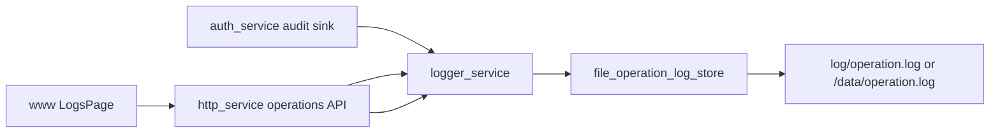

# logger_service Design

## 模块定位

`logger_service` 记录用户操作审计日志。它不负责普通进程日志；普通日志归
`infra::Log`。

## 总体框架图

## 核心职责

- 接收 `OperationRecord`。
- 查询操作日志。
- 导出操作日志。
- 控制日志文件大小和轮转数量。

## 接口归属

public API 在 `logger_service.h`。`OperationAction` 和 `OperationResult` 是操作
审计枚举，不替代 `event_service` 的运行事件。

## 状态与资源模型

日志存储是文件资源，路径由 app 启动配置决定。写入失败只能影响审计记录，不应阻断
核心媒体链路。

## 非目标

- 不替代 `infra::Log` 的进程日志。
- 不作为事件总线或告警长期归档。

## 风险与优化方向

- 不记录密码、token、认证头和大 payload。
- 操作日志查询必须限制 `limit`，避免 Web 查询放大 IO。
