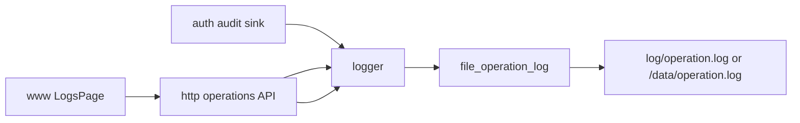

# logger

## 命名迁移

本模块命名迁移遵循`docs/refactor/README.md` 的命名规则。后续目录、静态库、public header、接口类、Options/Dependencies/Stats、工厂函数和变量名只按该基线迁移；本文件中的旧 `_service`、`stream_*`、`MetaRtc*` 或 `Yang*` 名称仅表示迁移前名称、历史说明或明确允许保留的协议概念。HTTP REST 路径、配置 schema、Web DTO 和 ONVIF 返回路径可以随完全重构同步迁移；变更必须在同一任务内更新调用方、配置样例和文档，不保留旧兼容适配。

## 模块定位

`logger` 记录用户操作审计日志。它不负责普通进程日志；普通日志归
`infra::Log`。

## 总体框架图

## 核心职责

- 接收 `OperationRecord`。
- 查询操作日志。
- 导出操作日志。
- 控制日志文件大小和轮转数量。

## 接口归属

public API 在 `logger.h`。`OperationAction` 和 `OperationResult` 是操作
审计枚举，不替代 `event` 的运行事件。

## 状态与资源模型

操作日志是文件资源，路径由 app 启动配置决定。写入失败只能影响审计记录，不应阻断
核心媒体链路。

## 非目标

- 不替代 `infra::Log` 的进程日志。
- 不作为事件总线或告警长期归档。

## 风险与优化方向

- 不记录密码、token、认证头和大 payload。
- 操作日志查询必须限制 `limit`，避免 Web 查询放大 IO。
- CSV 导出由 HTTP 边界做字段引号转义和表格公式前缀防护，避免逗号、换行、
  双引号或 `= + - @` 开头字段破坏导出文件。
