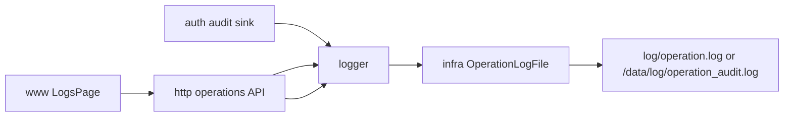

# logger

## 迁移状态

`logger` 独立库已并入 `infra`。本文件只保留历史迁移说明和操作审计契约索引；
长期设计正文维护在 `infra.md`，HTTP 查询和导出路由归 `http.md`。

public header 名称保持 `logger.h`，实际路径为 `libs/infra/include/logger.h`。
public API 名称保持 `ILogger`、`LoggerConfig`、`OperationRecord`、`OperationLogQuery`、
`OperationLogExportOptions` 和 `CreateLogger()`。

## 历史模块定位

独立 `logger` 模块曾记录用户操作审计日志。它不负责普通进程日志；普通日志归
`infra::Log`。这些职责现在由 `infra` 库内的操作审计功能承担。

## 总体框架图

## 核心职责

- 接收 `OperationRecord`。
- 查询操作日志。
- 导出操作日志。
- 控制日志文件大小和轮转数量。

## 接口归属

public API 在 `libs/infra/include/logger.h`。`OperationAction` 和 `OperationResult`
是操作审计枚举，不替代 `event` 的运行事件。

## 状态与资源模型

操作日志是文件资源，路径由 app 启动配置决定。写入失败只能影响审计记录，不应阻断
核心媒体链路。

## 非目标

- 不替代 `infra::Log` 的进程日志。
- 不作为事件总线或告警长期归档。

## 风险与优化方向

- 不记录密码、token、认证头和大 payload。
- 操作日志查询必须限制 `limit`，避免 Web 查询放大 IO。
- CSV 导出由 HTTP 边界做字段引号转义和表格公式前缀防护，避免逗号、换行、
  双引号或 `= + - @` 开头字段破坏导出文件。
