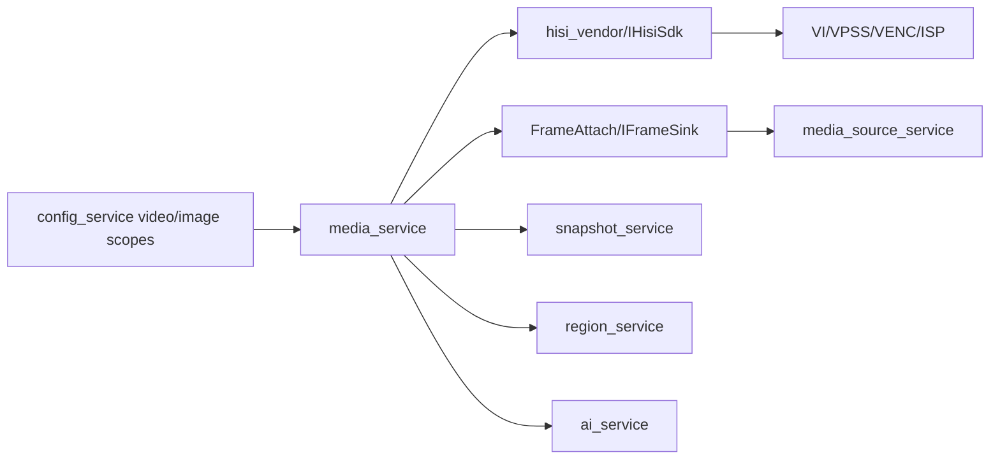

# media_service Design

## 模块定位

`media_service` 拥有视频 pipeline 生命周期、主/子码流启动停止、MPP/VENC/ISP
适配、编码帧输出、抓图来源、关键帧请求和视频/图像配置应用。它不拥有 RTSP、
HTTP、WebRTC、HLS/FLV 请求解析或 Web Console DTO。

## 总体框架图

## 核心职责

- 启动和停止视频 pipeline。
- 维护 stream 是否启动、codec、capabilities、channels。
- 对外提供 `AttachFrameSink`、`DetachFrameSink`、`RequestKeyFrame`。
- 应用 video/image 配置，并通过 SDK 控制 ISP、VENC 和相关媒体资源。
- 提供 `ImageStrategyStatus` 供 HTTP/Web 展示图像策略运行状态。

## 接口归属

public API 在 `media_service.h`：

- `IMediaService`
- `MediaServiceOptions`
- `ImageStrategyStatus`
- `CreateMediaService`

HTTP `/api/config/video`、`/api/config/image` 的业务配置语义归本模块，DTO 转换归
`http_service`，Web 表单归 `www`。

配置字段归属：

| scope | 字段组 | 归属说明 |
| --- | --- | --- |
| `video.streams.<main/sub>` | `enabled`、`codec`、`resolution`、`fps`、`bitrate_kbps` | VENC 通道和码流能力应用 |
| `video.streams.<main/sub>` | `rate_control`、`gop`、`gop_mode`、`smart_codec` | 编码控制和 HiSilicon SmartP/GOP 映射 |
| `image.basic` | brightness、contrast、saturation、sharpness、hue | ISP/CSC 基础图像控制 |
| `image.exposure` | mode、anti_flicker、exposure_time、gain、compensation、slow_shutter、max_exposure_time | AE/曝光策略 |
| `image.white_balance` / `image.enhancement` | white balance、denoise、gamma、defog | ISP 图像增强 |
| `image.backlight` / `image.orientation` / `image.color_mode` / `image.strategy` | 背光、镜像翻转、彩黑模式、自动图像策略 | 运行时图像策略和状态展示 |

字段新增或枚举变化必须同步 `http_service` DTO、`www/src/api/types.ts` 和
`www/README.md`。保存成功不能只代表 JSON 写入成功，还必须代表配置已经通过本模块
validate/apply。

## 状态与资源模型

`media_service` 是最接近硬件 pipeline 的状态拥有者。帧订阅是跨模块边界，订阅方
不能持有 SDK 内部资源，也不能在帧路径打普通诊断日志。关键帧请求必须通过
`RequestKeyFrame` 进入媒体模块。

## 音视频专项边界

产品只支持视频。音频配置兼容字段只能保持 disabled；不启动音频采集、编码、传输
或 UI/API。HiSilicon 静态库中的音频符号由 `hisi_vendor` 失败 stub 闭合。

## 风险与优化方向

- 帧路径避免多余拷贝、频繁分配和日志。
- 配置热应用失败必须回滚或明确报告错误，避免 Web 保存状态和硬件运行态不一致。
- MPP/VENC/ISP 结构转换留在 `hisi_vendor`，不要扩散到 HTTP 或 Web。
