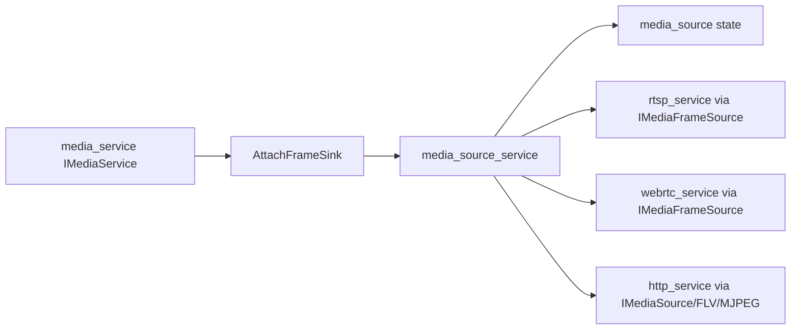

# media_source_service Design

## 模块定位

`media_source_service` 是媒体源服务壳，负责从 `media_service` 接收编码帧，并把帧
送入 `media_source` 状态模型，同时维护下游 frame sink、HTTP-FLV client 和
MJPEG client 注册。它是生产主链路中的协议媒体源入口。

## 总体框架图

## 核心职责

- 启动时向 `IMediaService` 订阅编码帧。
- 对 RTSP/WebRTC 暴露 `IMediaFrameSource`。
- 对 HTTP 暴露 HLS/status、FLV 和 MJPEG source 接口。
- 统一管理客户端数量限制和 keyframe 请求转发。

## 接口归属

public API 在 `media_source_service.h`：

- `MediaSourceServiceOptions`
- `MediaSourceServiceDependencies`
- `IMediaSourceService`
- `CreateMediaSourceService`

`ProtocolSubsystem` 创建本服务，并注入 RTSP、WebRTC、HTTP。

## 状态与资源模型

服务壳拥有和 `media_service` 的订阅关系。停止时必须先停止下游输出，再解除 frame
sink，避免回调访问已释放对象。

## 迁移边界

生产构建使用 `media_source_service` 替代旧 `stream_hub_service`。旧名称只允许在
legacy 文档和历史决策里出现。
