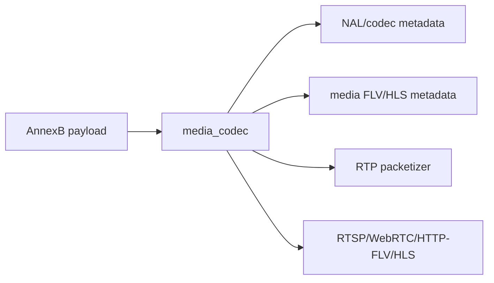

# media_codec

## 命名迁移

本模块命名迁移遵循`docs/refactor/README.md` 的命名规则。后续目录、静态库、public header、接口类、Options/Dependencies/Stats、工厂函数和变量名只按该基线迁移；本文件中的旧 `_service`、`stream_*`、`MetaRtc*` 或 `Yang*` 名称仅表示迁移前名称、历史说明或明确允许保留的协议概念。HTTP REST 路径、配置 schema、Web DTO 和 ONVIF 返回路径可以随完全重构同步迁移；变更必须在同一任务内更新调用方、配置样例和文档，不保留旧兼容适配。

## 模块定位

`media_codec` 提供 H.264/H.265 等码流解析、格式辅助和视频 RTP packetizer。
它是媒体和协议热路径的 codec 工具模块，不拥有 client session、HTTP 路由、
socket transport、SRTP 或媒体源状态。

## 总体框架图

## 核心职责

- 遍历 AnnexB NAL，解析 H.264/H.265 NAL type、关键帧和 parameter sets。
- 为 HLS/FLV/RTP 等下游输出提供 codec metadata、SPS/PPS/VPS 和 IDR 判断。
- 提供 AnnexB/AVCC/HVCC 基础转换工具，异常输入必须返回失败状态。
- 提供 RTSP/WebRTC 共用的 H.264/H.265 RTP packet view、时间戳转换和 FU 分片。
- 保持无业务状态或极少状态，供热路径复用。

## 接口归属

codec parser API 在 `media_codec.h`，归 `media_codec` 命名空间：

- AnnexB NAL 遍历：`ForEachAnnexBNalUnit`、`IAnnexBNalUnitSink`。
- H.264/H.265 NAL 列表：`H264NalUnitList`、`H265NalUnitList`。
- parameter set 和 keyframe 判断：`Contains*ParameterSets`、`Contains*Keyframe`。
- parameter set 提取：`ExtractH264ParameterSets`、`ExtractH265ParameterSets`。
- NAL type 常量和判断：`kH264NalType*`、`kH265NalType*`、
  `Is*ParameterSetNal`、`Is*IdrNal`。
- AnnexB/AVCC 辅助：`StripAnnexBStartCode`、`WriteNalLengthPrefix`、
  `AppendLengthPrefixedNal`、`BuildH264AvccRecord`、`BuildH265HvccRecord`。

RTP packetizer API 在 `rtp.h`，随 `media_codec` 模块构建，归
`live_stream::rtp` 命名空间：

- `RtpPacketizer` 支持 H.264/H.265 AnnexB NAL 解析和 FU-A/FU 分片。
- `RtpPacketView` / `RtpPacketSlice` 让 RTSP/WebRTC 以 slice 方式发送 RTP
  header、payload header 和原始 media payload。
- `RtpTimestampFromPtsUs()`、`IsRtpTimestampBackwards()` 和
  `RtpPayloadTypeForCodec()` 提供 90kHz RTP timestamp 与默认 video payload type
  辅助。
- `RtpPacketizerInput` 只接收 codec、AnnexB payload、PTS、payload type、
  sequence 和 SSRC，不依赖 `MediaFrame`、RTSP session 或 WebRTC peer。

实现文件按职责拆分：

- `annexb_reader.cpp`：AnnexB start code 扫描和通用 NAL 遍历。
- `h264_parser.cpp`：H.264 NAL list、SPS/PPS、IDR 判断。
- `h265_parser.cpp`：H.265 NAL list、VPS/SPS/PPS、IDR/CRA 判断。
- `avcc_writer.cpp`：4 字节 NAL 长度前缀、avcC/hvcC 记录构造。
- `rtp_packetizer.cpp`：RTP timestamp、header、H.264 FU-A 和 H.265 FU 分片。

## 状态与资源模型

NAL list 是栈上固定容量结构，最多记录 `kMaxNalUnitsPerFrame` 个单帧 NAL。`overflow`
只表示输入超过可记录数量，上层必须把它当作解析风险处理。模块只接收 AnnexB
payload 指针和长度，不依赖 `MediaFrame` 或基础媒体类型，不复制 payload 所有权，
也不缓存 codec 状态。参数集提取函数会把 SPS/PPS/VPS 拷贝到调用方提供的
`std::string`，用于 sequence header 或 SDP 等低频 metadata 输出。

RTP packetizer 输出的 `RtpPacketView` 只在 `IRtpPacketSink::OnRtpPacket()`
回调期间有效。header/FU header 保存在 packet view 内，media payload slice
仍指向输入 AnnexB payload；异步发送方必须用自己的 owner 机制保持底层媒体 buffer
生命周期。RTSP TCP interleaved 和 WebRTC SRTP 负责各自 transport 发送或加密，
`media_codec` 不保存 peer/session/socket 状态。

## 第二阶段冻结契约

- 生产命名空间已从旧 `stream_codec` 收敛为 `media_codec`。
- parser 契约冻结为 AnnexB 遍历、H.264/H.265 参数集提取、IDR 判断和
  AnnexB/AVCC/HVCC 辅助。
- `media_codec` 只依赖 `infra` 和标准库，不依赖基础媒体类型、HTTP、RTSP、WebRTC
  或 `media`。
- RTSP/WebRTC/HLS/HTTP-FLV 相邻接口只消费 `media_codec` 的 parser/metadata，
  不在协议模块内新增私有 H.264/H.265 parser。
- RTP packet view 归 `media_codec` 的 `rtp.h`，FLV/HLS 封装归
  `media`/`http_media` 等拥有边界。
- `ForEachAnnexBNalUnit` 输入为一帧 AnnexB payload，输出非空 NAL view；空输入、
  没有可用 NAL、start code 不完整或 sink 返回失败时整体返回失败。
- `ExtractH264ParameterSets` 和 `ExtractH265ParameterSets` 只用于低频 metadata
  输出，例如 SDP、FLV sequence header 或 track 初始化；热路径不得每包重复提取。
- `BuildH264AvccRecord` 和 `BuildH265HvccRecord` 输出调用方拥有的字符串，用于
  sequence header；codec 切换时由 `media` 触发重建。

## 非目标

- 不拥有 HLS/FLV 封装输出。
- 不拥有 RTP session、RTSP interleaved transport、UDP socket、SRTP 或 WebRTC peer。
- 不维护 GOP cache、sequence header cache 或媒体 ready 状态。
- 不处理音频 codec。

## 风险与优化方向

- 解析函数应避免重复分配和大拷贝。
- codec 切换必须让上层重建 sequence/header/cache。
