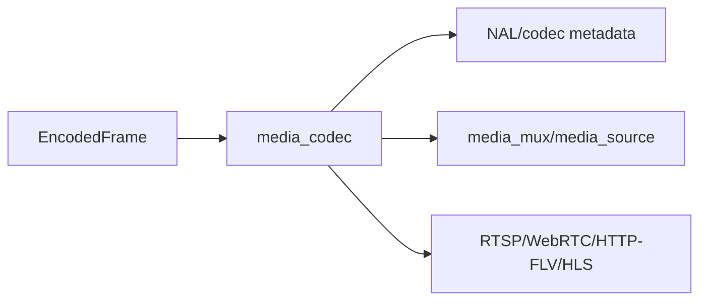

# media_codec

## 命名迁移

本模块命名迁移遵循仓库根目录 `重构.md` 的“任务 1 命名迁移基线”。后续目录、静态库、public header、接口类、Options/Dependencies/Stats、工厂函数和变量名只按该基线迁移；本文件中的旧 `_service`、`stream_*`、`MetaRtc*` 或 `Yang*` 名称仅表示迁移前名称、历史说明或明确允许保留的协议概念。HTTP REST 路径、配置 schema、Web DTO 和 ONVIF 返回路径可以随完全重构同步迁移；变更必须在同一任务内更新调用方、配置样例和文档，不保留旧兼容适配。

## 模块定位

`media_codec` 提供 H.264/H.265/MJPEG 等码流解析和格式辅助能力。它是媒体和协议
热路径的工具模块，不拥有 client session、HTTP 路由或媒体源状态。

## 总体框架图

## 核心职责

- 解析 codec metadata、关键帧和 parameter sets。
- 为 HLS/FLV/RTP 等下游封装提供必要的 codec 信息。
- 保持无业务状态或极少状态，供热路径复用。

## 接口归属

public API 在 `media_codec.h`，归 `media_codec` 命名空间：

- AnnexB NAL 遍历：`ForEachAnnexBNalUnit`、`IAnnexBNalUnitSink`。
- H.264/H.265 NAL 列表：`H264NalUnitList`、`H265NalUnitList`。
- parameter set 和 keyframe 判断：`Has*ParameterSets`、`Has*KeyFrame`。
- parameter set 提取：`ExtractH264ParameterSets`、`ExtractH265ParameterSets`。

## 状态与资源模型

NAL list 是栈上固定容量结构，最多记录 `kMaxNalUnitsPerFrame` 个单帧 NAL。`overflow`
只表示输入超过可记录数量，上层必须把它当作解析风险处理。模块不持有
`EncodedFrame`、不复制 payload 所有权，也不缓存 codec 状态。

## 非目标

- 不拥有 HLS/FLV/RTP 封装输出。
- 不维护 GOP cache、sequence header cache 或媒体 ready 状态。
- 不处理音频 codec。

## 风险与优化方向

- 解析函数应避免重复分配和大拷贝。
- codec 切换必须让上层重建 sequence/header/cache。
