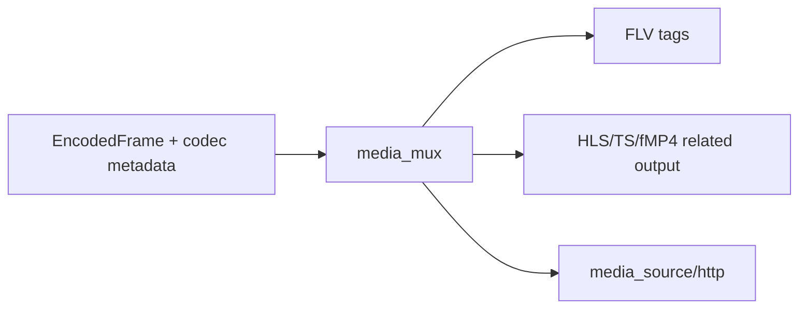

# media_mux

## 命名迁移

本模块命名迁移遵循仓库根目录 `重构.md` 的“任务 1 命名迁移基线”。后续目录、静态库、public header、接口类、Options/Dependencies/Stats、工厂函数和变量名只按该基线迁移；本文件中的旧 `_service`、`stream_*`、`MetaRtc*` 或 `Yang*` 名称仅表示迁移前名称、历史说明或明确允许保留的协议概念。HTTP REST 路径、配置 schema、Web DTO 和 ONVIF 返回路径可以随完全重构同步迁移；变更必须在同一任务内更新调用方、配置样例和文档，不保留旧兼容适配。

## 模块定位

`media_mux` 提供媒体封装辅助，例如 HLS、FLV 或其他下游协议需要的输出构造。
它不拥有客户端注册、HTTP socket、playlist 状态或媒体源生命周期。

## 总体框架图

## 核心职责

- 把编码帧和 codec metadata 转成下游协议需要的封装片段。
- 尽量输出 slice/view，减少热路径 string 拼接和 payload 拷贝。

## 接口归属

public API 在 `media_mux.h`，归 `media_mux` 命名空间：

- RTP：`RtpPacketizer`、`RtpPacketView`、`IRtpPacketSink`。
- FLV：`BuildFlvFileHeader`、`BuildH264FlvSequenceHeaderTag`、
  `BuildH265FlvSequenceHeaderTag`、`Build*FlvVideoTagView`。
- HLS/TS：`TsMuxerState`、`TsSegmentBuffer`、`AppendTsSegmentHeader`、
  `Append*NalUnitsToTsSegmentBuffer`。

## 状态与资源模型

`RtpPacketView` 和 `FlvVideoTagView` 是 slice/view 输出，payload 指针仍指向输入帧或
调用方提供的临时 header buffer。调用方必须在输入帧生命周期内完成发送或复制。
`TsSegmentBuffer` 的内存由调用方分配并控制容量，`media_mux` 只追加封装字节。

## 非目标

- 不拥有客户端注册、socket 写、playlist、GOP cache 或 ready 状态。
- 不决定是否请求关键帧，也不处理配置热应用。
- 不处理音频封装。

## 风险与优化方向

- 高容量封装输出不能每帧反复分配大 buffer。
- `media_source` 负责缓存和 ready 状态；`media_mux` 只负责封装构造。
