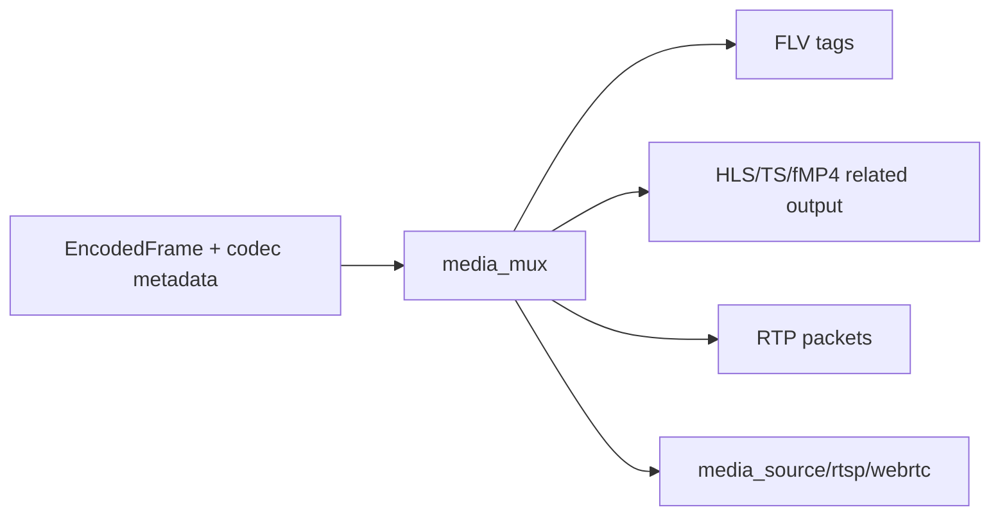

# media_mux

## 命名迁移

本模块命名迁移遵循仓库根目录 `重构.md` 的“任务 1 命名迁移基线”。后续目录、静态库、public header、接口类、Options/Dependencies/Stats、工厂函数和变量名只按该基线迁移；本文件中的旧 `_service`、`stream_*`、`MetaRtc*` 或 `Yang*` 名称仅表示迁移前名称、历史说明或明确允许保留的协议概念。HTTP REST 路径、配置 schema、Web DTO 和 ONVIF 返回路径可以随完全重构同步迁移；变更必须在同一任务内更新调用方、配置样例和文档，不保留旧兼容适配。

## 模块定位

`media_mux` 提供媒体封装辅助，例如 HLS、FLV 或其他下游协议需要的输出构造。
任务 8 后本模块仍作为过渡封装模块存在，但内部文件已按 RTP、FLV、HLS 职责拆分。
它不拥有客户端注册、HTTP socket、playlist 状态或媒体源生命周期。

## 总体框架图

## 核心职责

- 把编码帧和 codec metadata 转成下游协议需要的封装片段。
- 提供 RTSP/WebRTC 共用 `RtpPacketizer`，避免协议模块各自实现 H.264/H.265 RTP 分片。
- 提供 FLV tag 和 HLS/TS segment body 构造；后续任务可以按协议边界继续拆入
  `http_media`、`rtsp` 或 `webrtc`。
- 尽量输出 slice/view，减少热路径 string 拼接和 payload 拷贝。

## 接口归属

public API 在 `media_mux.h`，归 `media_mux` 命名空间：

- RTP：`RtpPacketizerOptions`、`RtpPacketizerInput`、`RtpPacketizer`、
  `RtpPacketView`、`IRtpPacketSink`。
- FLV：`BuildFlvFileHeader`、`BuildH264FlvSequenceHeaderTag`、
  `BuildH265FlvSequenceHeaderTag`、`Build*FlvVideoTagView`。
- HLS/TS：`TsMuxerState`、`TsSegmentBuffer`、`AppendTsSegmentHeader`、
  `Append*NalUnitsToTsSegmentBuffer`。

实现文件按职责拆分：

- `rtp_packetizer.cpp`：H.264 FU-A、H.265 FU、RTP header、seq、ssrc、
  timestamp、marker bit 和 payload type。
- `flv_muxer.cpp`：FLV file header、H.264/H.265 sequence header 和 video tag view。
- `hls_maker.cpp`：PAT/PMT、PES、TS packet 写入和 HLS segment body 追加。

## 状态与资源模型

`RtpPacketView` 和 `FlvVideoTagView` 是 slice/view 输出。`RtpPacketView` 自持 RTP
header 和 FU header，media payload slice 仍指向输入帧 payload；发送层如果异步持有
payload，必须保留输入帧/VideoBuffer 引用。`FlvVideoTagView` 自持 FLV tag header、
NAL length 和 PreviousTagSize，media payload slice 仍指向输入帧 payload。
`TsSegmentBuffer` 的内存由调用方分配并控制容量，`media_mux` 只追加封装字节。

## 第二阶段冻结契约

- 生产命名空间已从旧 `stream_mux` 收敛为 `media_mux`。
- `RtpPacketizer` 冻结为 RTSP/WebRTC 共用契约，支持 H.264/H.265 AnnexB 输入、
  seq/ssrc/90k timestamp/payload type、marker bit 和 FU 分片；`RtpPacketizerInput`
  的 `payload_type=0` 表示按 codec 使用 `RtpPacketizerOptions` 默认值，`ssrc`
  必须非 0。
- `RtpPacketizerInput.pts_us` 必须是 `media_source` corrected PTS；RTSP 和 WebRTC
  不得再各自修正 RTP timestamp。
- `RtpPacketView` 输出后立即交给 transport；异步发送时调用方必须通过
  `NetBufferOwner` 或等价 owner 保留 `MediaFrame` / `VideoBuffer` 引用。
- `FlvVideoTagView` 输出 FLV tag header、payload slices 和 previous tag size；
  HTTP-FLV 起播顺序固定为 FLV header、metadata/sequence header、cached GOP、
  live tag。
- HLS/TS append 只追加 segment body。调用方必须先 finalize segment body，再更新
  playlist；半成品 segment 不得暴露给 HTTP。
- `media_mux` 继续是格式工具模块，不能恢复旧泛名接口、私有 socket 状态或只转调
  wrapper。

## 非目标

- 不拥有客户端注册、socket 写、playlist、GOP cache 或 ready 状态。
- 不决定是否请求关键帧，也不处理配置热应用。
- 不处理音频封装。

## 风险与优化方向

- 高容量封装输出不能每帧反复分配大 buffer。
- `media_source` 负责缓存和 ready 状态；`media_mux` 只负责封装构造。
