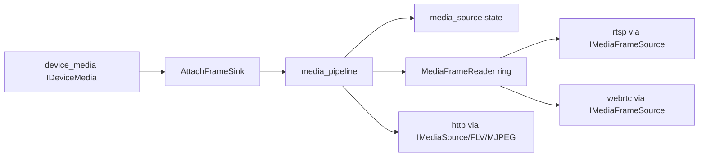

# media_pipeline

## 命名迁移

本模块命名迁移遵循仓库根目录 `重构.md` 的“任务 1 命名迁移基线”。后续目录、静态库、public header、接口类、Options/Dependencies/Stats、工厂函数和变量名只按该基线迁移；本文件中的旧 `_service`、`stream_*`、`MetaRtc*` 或 `Yang*` 名称仅表示迁移前名称、历史说明或明确允许保留的协议概念。HTTP REST 路径、配置 schema、Web DTO 和 ONVIF 返回路径可以随完全重构同步迁移；变更必须在同一任务内更新调用方、配置样例和文档，不保留旧兼容适配。

## 模块定位

`media_pipeline` 是设备帧到媒体源的装配层，负责从 `device_media` 接收编码帧，
并把帧送入 `media_source` 状态模型，同时维护下游 frame sink、HTTP-FLV client 和
MJPEG client 注册。它固定生产主链路为
`device_media -> media_pipeline -> media_source`，不拥有协议 socket、HTTP 请求解析
或设备 SDK 配置应用。

## 总体框架图

## 核心职责

- 启动时向 `IDeviceMedia` 订阅编码帧。
- 接收 `device_media` 的 stream running/closed/error 状态，并在 closed/error 时
  清理对应码流的 `media_source` stream context、reader cache 和 pending frame。
- 在 stream start、stream stop、codec 切换和 `TimestampCorrector` 发现回退/跳变时，
  统一清理 GOP、HLS、FLV sequence/GOP、MJPEG latest frame、reader live queue 和
  pending frame。
- 对 RTSP/WebRTC 暴露 `IMediaFrameSource`。
- 对协议输出暴露 `AttachFrameReader`、`GetFrameReaderStartData`、
  `PopFrameReaderFrame` 和 `DetachFrameReader`。
- 对 HTTP 暴露 HLS/status、FLV 和 MJPEG source 接口。
- 统一管理客户端数量限制和 keyframe 请求转发。

## 接口归属

public API 在 `media_pipeline.h`：

- `MediaPipelineOptions`
- `MediaPipelineDependencies`
- `IMediaPipeline`
- `CreateMediaPipeline`

`ProtocolSubsystem` 创建本服务，并注入 RTSP、WebRTC、HTTP。

## 状态与资源模型

服务壳拥有和 `device_media` 的订阅关系。停止时必须先停止下游输出，再解除 frame
sink，避免回调访问已释放对象。设备码流停止、配置重启或错误时，本模块负责把对应
stream 的 ready、GOP、HLS/FLV/MJPEG 状态和 reader 缓存重置到 closed/error 语义；
codec 切换和 timestamp reset 走同一 `ResetStreamForReasonLocked` 路径，下游协议
不直接订阅 `device_media`，也不重复维护设备侧 GOP 或时间戳修正。

资源上限来自 `MediaPipelineOptions`：

| option | 作用 |
| --- | --- |
| `hls_segment_duration_ms` | 单个 HLS segment 目标时长 |
| `hls_playlist_depth` | playlist 暴露的完成 segment 数量 |
| `hls_segment_retain_count` | 额外保留给滞后客户端读取的旧 segment 数量 |
| `max_flv_clients` | HTTP-FLV 客户端注册上限 |
| `max_mjpeg_clients` | MJPEG 客户端注册上限 |
| `max_frame_readers` | RTSP/WebRTC 等下游 reader 总上限 |

默认 HLS 使用 1s segment、2 个完成 segment 的 playlist 和 3 个旧 segment 保留。
这个配置优先降低浏览器预览首播等待，同时保留少量余量给滞后 segment 请求。

启动后本服务是 `device_media` 到 RTSP/WebRTC/HTTP 的扇出点。新增下游协议必须通过
`IMediaFrameSource`、`IMediaSource`、`IMediaFlvSource` 或 `IMediaMjpegSource`
消费，不能直接订阅 `device_media` 并绕过统一 keyframe 请求和资源上限。

`MediaSourceStats` 的 reader 字段由本模块汇总：`active_frame_readers` 表示显式
reader 数，`cached_frames`、`cached_bytes`、总 slow reader、main/sub slow reader
和主/子码流 last timestamp
来自同一个 `FrameRing`。codec generation 和 last reset reason 来自对应
`media_source` stream context，用于 HTTP/Web API 后续序列化。

## 迁移边界

生产构建使用 `media_pipeline` 替代旧 `stream_hub_service`。旧名称只允许在
legacy 文档和历史决策里出现。

## 非目标

- 不解析 HTTP 请求，不写 socket。
- 不拥有 HLS/FLV/MJPEG 的封装算法细节；HLS/FLV 构造归 `media_source` 内部。
- 不应用设备 video/image 配置，不直接调用 `hisi_vendor` SDK。
- 不保存 Web 前端状态或 mock 数据。
