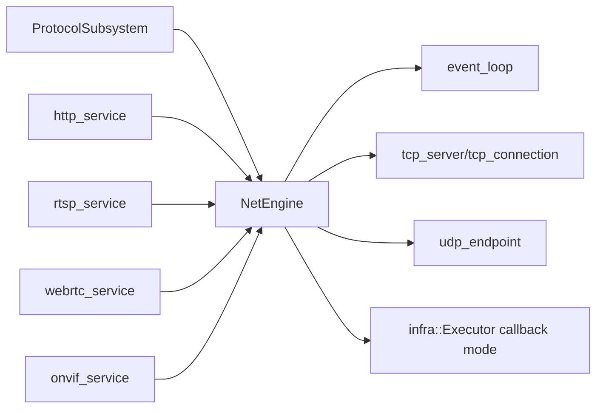

# net_service Design

## 模块定位

`net_service` 提供共享网络引擎、TCP/UDP primitives、event loop 和 callback
dispatch。它不拥有 HTTP、RTSP、ONVIF 或 WebRTC 的业务语义。

## 总体框架图

## 核心职责

- 管理 IO thread 和 callback dispatch。
- 提供 TCP server/connection、UDP endpoint 和 fd/eventfd 封装。
- 将网络回调投递到指定 executor，避免协议模块直接阻塞 IO loop。

## 接口归属

public API 在 `net_service.h`。协议语义、路由、session 和 DTO 归对应协议模块。

## 风险与优化方向

- 回调队列容量要匹配协议吞吐，避免流量高峰时无限堆积。
- 网络关闭必须先停止上层协议，再释放 NetEngine。
