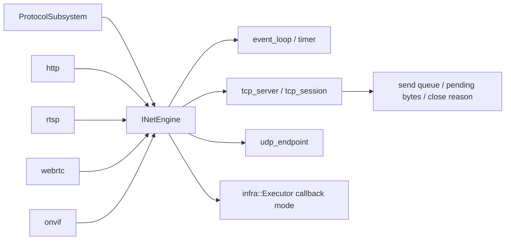

# net

## 命名迁移

本模块命名迁移遵循仓库根目录 `重构.md` 的“任务 1 命名迁移基线”。后续目录、静态库、public header、接口类、Options/Dependencies/Stats、工厂函数和变量名只按该基线迁移；本文件中的旧 `_service`、`stream_*`、`MetaRtc*` 或 `Yang*` 名称仅表示迁移前名称、历史说明或明确允许保留的协议概念。HTTP REST 路径、配置 schema、Web DTO 和 ONVIF 返回路径可以随完全重构同步迁移；变更必须在同一任务内更新调用方、配置样例和文档，不保留旧兼容适配。

## 模块定位

`net` 提供共享网络引擎、EventPoller 风格 event loop、TCP session、
UDP endpoint、网络发送 buffer、timer 和 callback dispatch。它不拥有 HTTP、
RTSP、ONVIF 或 WebRTC 的业务语义。

## 总体框架图

## 核心职责

- 管理 IO thread 和 callback dispatch。
- 提供 TCP server/session、UDP endpoint 和 fd/eventfd 封装。
- 统一 TCP send queue、pending bytes、发送 buffer 上限、读写 timeout、
  send stall 检测和 close reason。
- 提供一次性/周期 IO timer；`CancelIoTimer()` 或 `INetEngine::Stop()` 后
  timer 不再回调。
- 提供 UDP `SendTo()` 和 selected peer 模型，供 RTP、ICE/STUN、ONVIF
  discovery 这类 UDP 生命周期接入。
- 将网络回调投递到指定 executor，避免协议模块直接阻塞 IO loop。

## 接口归属

public API 在 `net.h`。`INetEngine` 是上层模块依赖的抽象接口，
`NetEngineImpl` 是 `net` 内部实现。协议语义、路由、session 和 DTO 归对应协议模块。

冻结契约：

- `TcpServer`：`ListenTcp()` 创建监听，`CloseTcp()` 先停止 accept，再由上层
  按连接 id 关闭已有 session。
- `TcpSession`：以 `ConnectionId` 表达 public session；发送统一走
  `Send()`/`SendSlices()`，慢客户端由 `send_queue_capacity`、
  `send_buffer_limit_bytes`、`send_stall_timeout_ms`、`write_timeout_ms`
  触发关闭。队列项数达到上限关闭原因为 `queue_full`，pending bytes 超过
  `send_buffer_limit_bytes` 关闭原因为 `pending_limit`。
- `TcpCloseReason`：`on_close` 必须携带关闭原因；协议模块用它释放 media reader、
  记录慢客户端和区分 peer/local/timeout/error。协议模块需要主动标记解析失败或
  鉴权失败时，可以调用 `Close(connection_id, reason)`；普通本地关闭继续调用
  `Close(connection_id)`。
- `UdpEndpoint`：`BindUdp()`/`CloseUdp()` 管生命周期；`SetUdpPeer()`、
  `SendToPeer()` 用于已选择 peer 的 RTP 或 ICE/STUN，`SendTo()` 用于
  ONVIF discovery 这类逐包目标地址。
- `Timer`：`RunOnIoAfter()` 是一次性 timer，`RunOnIoEvery()` 是周期 timer，
  id 由 `INetEngine` 全局分配，避免多 IO loop 下取消误命中。
- `Buffer`：`NetBufferSlices` 只表达网络发送/接收 buffer。可通过
  `NetBufferOwner` 延长媒体 payload 生命周期，但不能携带协议业务语义。

`TcpCloseReason` 枚举值冻结为：`normal`、`remote_close`、`parse_error`、
`auth_failed`、`queue_full`、`pending_limit`、`send_stall`、`read_timeout`、
`write_timeout`、`internal_error`。协议模块可以把这些原因映射为自己的业务
diagnostics，但不能新增一套不可比较的 socket close reason。

`NetConnectionDiagnostics` 字段冻结为：

| 字段 | 语义 |
| --- | --- |
| `connection_id` | `net` 分配的 TCP connection id |
| `owner_protocol` | `http`、`rtsp`、`onvif` 等上层协议 |
| `remote_address` / `local_address` | 文本地址和端口 |
| `pending_bytes` | 当前等待发送的总字节数 |
| `send_queue_length` | 当前等待发送的队列长度 |
| `last_write_at_ms` | 最近一次成功写 socket 的时间 |
| `close_reason` | 关闭后保留的 `TcpCloseReason` 文本 |
| `open` | 连接是否仍在 `net` 活跃连接表中 |

`GetConnectionDiagnostics(connection_id)` 返回单连接诊断；连接关闭后 `net` 会保留最近
128 条关闭诊断，`GetConnectionDiagnosticsSnapshot()` 同时返回当前活跃连接和最近关闭
连接，供 `/api/media/sessions` 聚合。字段语义仍归 `net`。

## 状态与资源模型

`INetEngine` 拥有 IO thread、fd/eventfd、TCP/UDP endpoint 和 callback dispatch
队列。上层协议停止时必须先解除连接、session 或 endpoint，再停止网络引擎。
板端默认按 Hi3516DV300 双核 Cortex-A7 配置 2 个 net IO thread；线程亲和性是
`NetEngineOptions` 的可选实验项，默认关闭。只有板端实测确认某个协议或 IRQ 抖动
需要隔离时，才打开 `enable_thread_affinity` 并指定 `first_io_cpu`，避免在双核
设备上把 net、media、SDK callback 和 kernel softirq 过早绑死导致反向排队。

TCP session 内部持有有界发送队列。无 owner 的小 slice 会内联复制，大 slice 会
复制到网络 buffer；带 `NetBufferOwner` 的 slice 只持有引用，由 owner 的
ref/unref 回调保证跨线程和异步发送期间 payload 存活。
写侧按队列项内的 slice 组 `sendmsg()` 聚合发送；部分写成功后按实际写入字节推进
slice offset 并释放已完成队列项。`net` 仍不解析媒体语义，也不跨队列项重排发送顺序。

HTTP、RTSP、ONVIF 和 WebRTC 不再各自维护不可比较的 socket 发送队列。长连接
只能通过 `INetEngine` 的 pending bytes、connection diagnostics 和 close callback
观察 backpressure。
协议模块可以保留业务层 parser/session 状态，但不能绕过 `net` 管 socket 写队列。

## 非目标

- 不解析 HTTP、RTSP、ONVIF、WebRTC 业务协议。
- 不维护认证、路由、媒体 ready 或客户端业务状态。
- 不解析 RTP、RTSP interleaved、HTTP chunk、WebRTC STUN/DTLS/SRTP 等协议包。

## 风险与优化方向

- 回调队列容量要匹配协议吞吐，避免流量高峰时无限堆积。
- 网络关闭必须先停止上层协议，再释放 INetEngine。
- `send_buffer_limit_bytes` 需要按 HTTP-FLV/HLS/MJPEG、RTSP TCP interleaved 和
  WebRTC signaling 的峰值分别配置，避免慢客户端持有过多媒体 payload 引用。
- `CallbackMode::kPostToExecutor` 会复制接收数据；热路径协议应优先缩短回调处理，
  避免 executor 队列成为新的内存堆积点。
