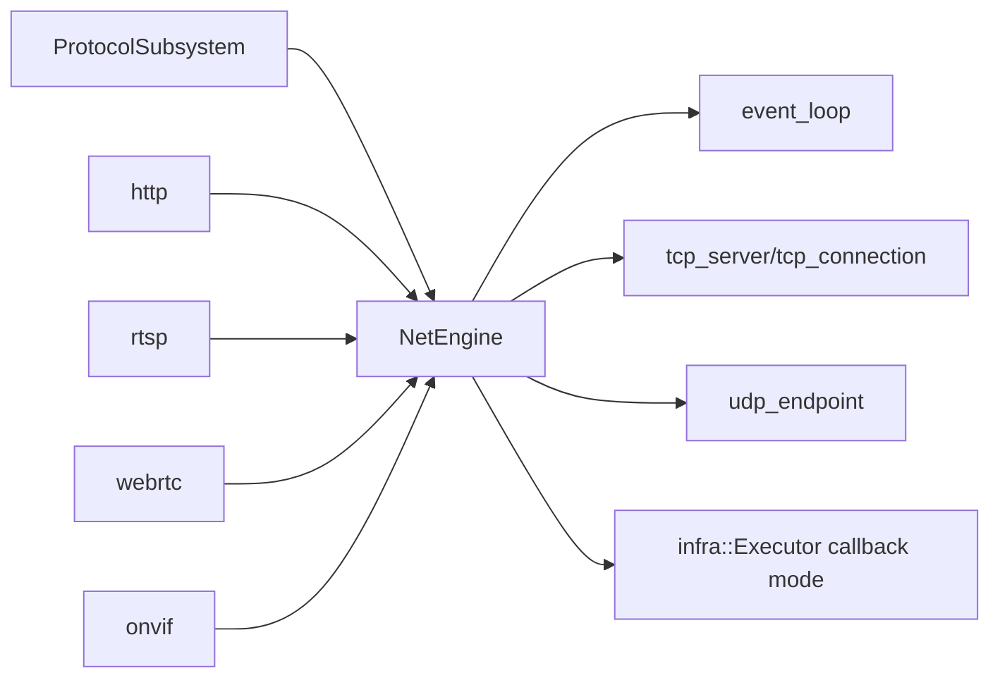

# net

## 命名迁移

本模块命名迁移遵循仓库根目录 `重构.md` 的“任务 1 命名迁移基线”。后续目录、静态库、public header、接口类、Options/Dependencies/Stats、工厂函数和变量名只按该基线迁移；本文件中的旧 `_service`、`stream_*`、`MetaRtc*` 或 `Yang*` 名称仅表示迁移前名称、历史说明或明确允许保留的协议概念。HTTP REST 路径、配置 schema、Web DTO 和 ONVIF 返回路径可以随完全重构同步迁移；变更必须在同一任务内更新调用方、配置样例和文档，不保留旧兼容适配。

## 模块定位

`net` 提供共享网络引擎、TCP/UDP primitives、event loop 和 callback
dispatch。它不拥有 HTTP、RTSP、ONVIF 或 WebRTC 的业务语义。

## 总体框架图

## 核心职责

- 管理 IO thread 和 callback dispatch。
- 提供 TCP server/connection、UDP endpoint 和 fd/eventfd 封装。
- 将网络回调投递到指定 executor，避免协议模块直接阻塞 IO loop。

## 接口归属

public API 在 `net.h`。协议语义、路由、session 和 DTO 归对应协议模块。

## 状态与资源模型

`NetEngine` 拥有 IO thread、fd/eventfd、TCP/UDP endpoint 和 callback dispatch
队列。上层协议停止时必须先解除连接、session 或 endpoint，再停止网络引擎。

## 非目标

- 不解析 HTTP、RTSP、ONVIF、WebRTC 业务协议。
- 不维护认证、路由、媒体 ready 或客户端业务状态。

## 风险与优化方向

- 回调队列容量要匹配协议吞吐，避免流量高峰时无限堆积。
- 网络关闭必须先停止上层协议，再释放 NetEngine。
