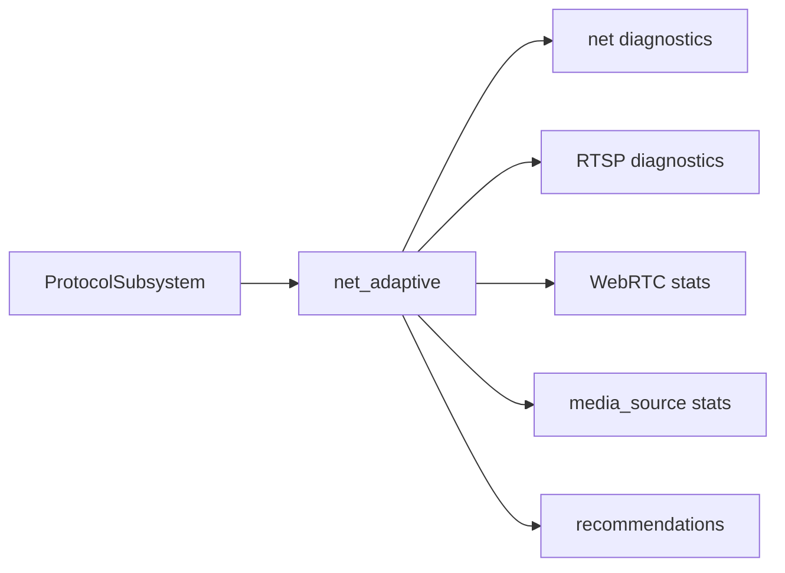

# net_adaptive

## 模块定位

`net_adaptive` 是网络质量与实时预览自适应协调器。它从 `net`、
`media_source`、RTSP 和 WebRTC 的公开 diagnostics 采样，计算网络压力和策略建议。
它不反向注入 RTSP/WebRTC/HLS/FLV，也不直接修改码率、帧率或码流选择。

## 设计目标与非目标

- 统一观察 TCP pending bytes、send queue、RTSP session、WebRTC peer 和
  media reader slow 等事实。
- 输出 `NetAdaptiveRecommendation` 和按流 `NetAdaptiveStreamDecision`，供 app
  或后续 media_pipeline/device_media 决定是否执行。
- v1 只观察和建议，不自动降码率、降帧率、切子码流。
- HLS 按分段拉取观察，不套用 RTSP/WebRTC/FLV 的慢推流模型。

## 总体框架图

## 核心职责

- 周期采样网络和媒体公开状态。
- 将 pending bytes、send queue、slow reader、WebRTC dropped frame 按各自阈值
  归一化为 `normal/watch/constrained` pressure level。
- 按 protocol、target 和 stream 保存目标状态，对 pending bytes 使用 EWMA 平滑。
- 连续多次采样达到阈值后才输出建议，并使用 cooldown 避免重复抖动建议。
- 给出 request key frame、prefer sub stream、close slow client、may restore main
  stream 等建议/决策状态。
- 按 stream 聚合多个 target 的 pressure，形成执行器可消费的稳定决策面。
- RTSP 优先使用 session diagnostics，`net` 层只兜底观察 HTTP/未被专用协议
  diagnostics 覆盖的媒体连接；ONVIF 不参与媒体自适应。

## 接口归属

public API 在 `net_adaptive.h`。协议模块不包含该头文件，不持有
`INetAdaptive`。依赖由 app 组合根创建和注入。

`GetRecommendations()` 返回最近一次采样窗口产生的建议；`GetRecommendationHistory()`
返回有界历史，供后续 HTTP/API 或执行器消费；`GetTargetStates()` 返回当前被观察
目标的 pressure signal、EWMA、连续异常计数和恢复样本计数；`GetStreamDecisions()`
返回按码流聚合后的当前决策。

## 状态与资源模型

`net_adaptive` 使用自有轻量采样线程，避免把 diagnostics 聚合放进 `net` IO loop。
停止时必须唤醒并 join 采样线程。内部只缓存最近一次 stats 和 recommendations，
以及有限的目标状态，不保存协议 session 所有权。目标长时间不再出现会自动过期。

策略默认值：

| 字段 | 默认值 | 语义 |
| --- | --- | --- |
| `pending_bytes_watch` | 256 KiB | 进入 watch 状态的 pending bytes EWMA |
| `pending_bytes_constrained` | 768 KiB | 进入 constrained 状态的 pending bytes EWMA |
| `watch_sample_threshold` | 2 | 连续 watch 样本数达到后才建议 |
| `constrained_sample_threshold` | 2 | 连续 constrained 样本数达到后才建议 |
| `recovery_sample_threshold` | 5 | 连续 normal 样本数达到后才允许恢复判断 |
| `send_queue_watch` | 32 | 发送队列长度进入 watch 的阈值 |
| `send_queue_constrained` | 96 | 发送队列长度进入 constrained 的阈值 |
| `slow_readers_watch` | 1 | 慢 media reader 进入 watch 的阈值 |
| `slow_readers_constrained` | 2 | 慢 media reader 进入 constrained 的阈值 |
| `webrtc_dropped_frames_watch` | 1 | 单采样周期 WebRTC 丢帧进入 watch 的阈值 |
| `webrtc_dropped_frames_constrained` | 8 | 单采样周期 WebRTC 丢帧进入 constrained 的阈值 |
| `recommendation_cooldown_ms` | 5000 | 同一目标重复建议冷却时间 |
| `recommendation_history_limit` | 64 | 保留的建议历史条数 |

## 风险与优化方向

- v1 建议不自动执行，避免误伤实时预览主链路。
- 后续如果要自动执行，只能通过 media_pipeline/device_media 的显式执行接口接入。
- WebRTC 的 PLI/FIR/NACK/TWCC 仍是协议反馈；`net_adaptive` 只观察其结果。
- `media_source` 提供 main/sub slow reader 数，`net_adaptive` 按实际 stream 归档
  慢读压力，避免子码流慢读误触发主码流决策。
