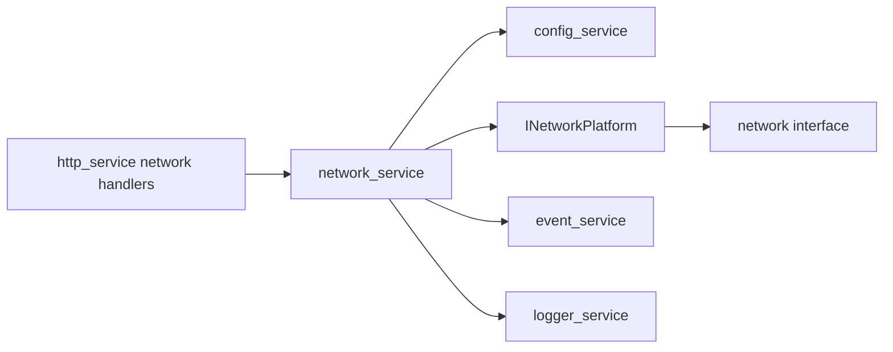

# network_service Design

## 模块定位

`network_service` 负责网口配置、状态查询和 Linux 网络配置应用。它不拥有 HTTP、
RTSP、ONVIF 端口策略，也不拥有全局 advertise host 推导，除非配置契约明确要求。

## 总体框架图

## 核心职责

- 读取和应用网络配置。
- 查询网卡地址、链路和运行状态。
- 使用 `network.default_ifname`，默认 fallback 为 `eth0`。
- 发布 `kNetworkChanged` 并记录操作日志。

## 接口归属

public API 在 `network_service.h`。Web 网络表单归 `www`，HTTP DTO 归
`http_service`。

## 状态与资源模型

网络配置来自 `network` scope，运行状态来自 `INetworkPlatform` 查询。配置应用可能
修改 Linux 网卡、DNS 或路由状态；模块只报告平台结果，不缓存 Web 推导状态。

## 非目标

- 不拥有 HTTP/RTSP/ONVIF 的监听生命周期。
- 不由前端推导设备 advertise host 或链路状态。

## 风险与优化方向

- 应用网络配置可能导致当前 HTTP 连接断开，Web 需要以后端返回和重连策略处理。
- 不要在前端或 HTTP handler 中绕过 `network_service` 直接解释 Linux 网卡状态。
