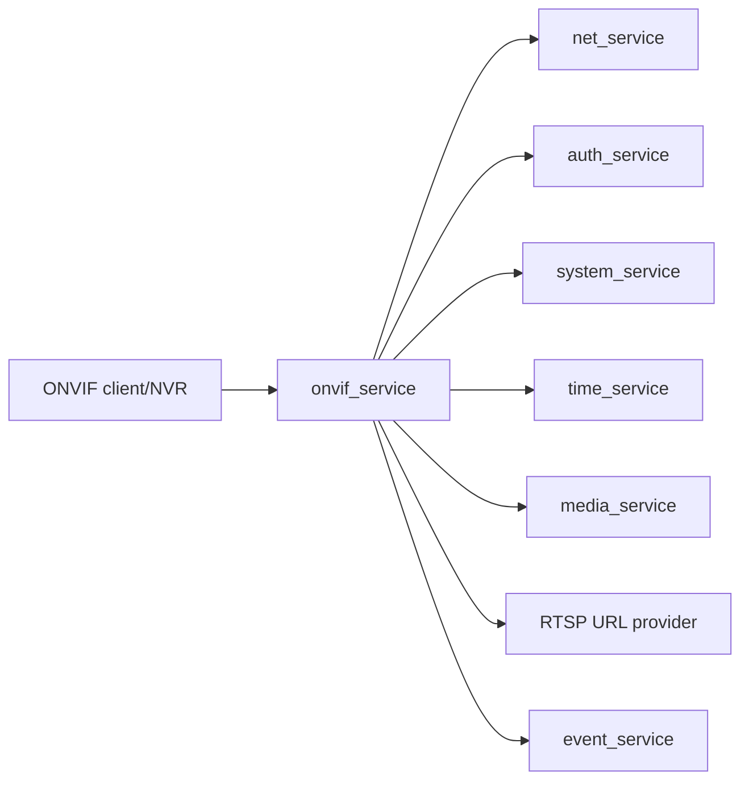

# onvif_service Design

## 模块定位

`onvif_service` 负责 ONVIF discovery、device/media service、SOAP/XML/HTTP
响应和 ONVIF 认证。它不拥有 RTSP session 内部状态，也不直接构造 Web UI。

## 总体框架图

## 核心职责

- WS-Discovery 设备发现。
- Device service 和 Media service SOAP 响应。
- ONVIF auth。
- 根据 runtime config 生成 RTSP 和 snapshot URL。

## 接口归属

public API 在 `onvif_service.h`。ONVIF advertise host、manufacturer、model、
firmware version 等运行参数由 app 加载后传入。

## 风险与优化方向

- ONVIF metadata 不应复制 RTSP session 状态。
- 认证逻辑要和 factory password 策略一致。
- SOAP/XML 响应字段变化需要兼容 NVR 客户端。
