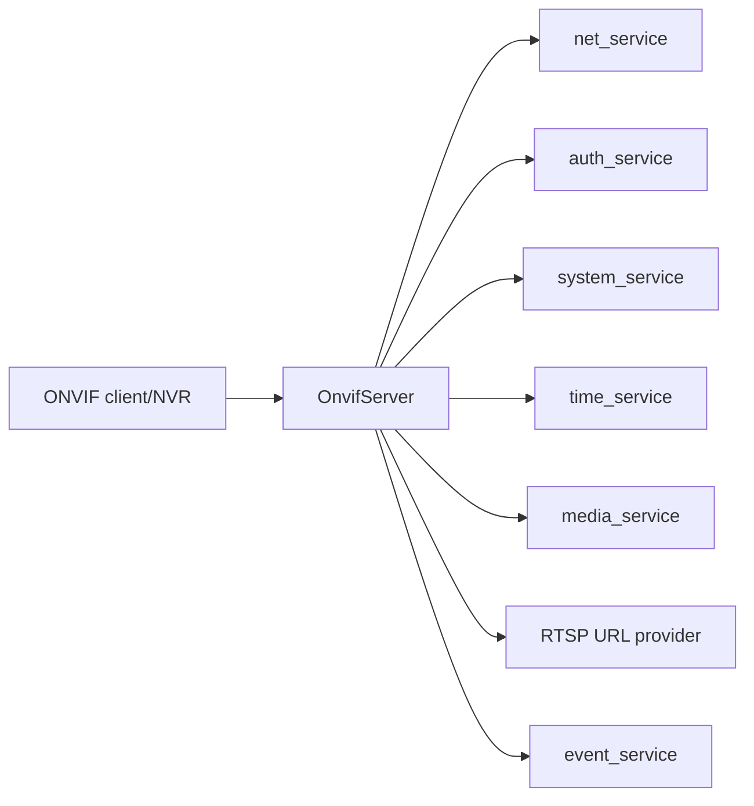

# onvif_service Design

## 模块定位

`onvif_service` 负责设备端 ONVIF WS-Discovery、device/media service、
SOAP/XML/HTTP 响应和 ONVIF 认证。它不拥有 RTSP session 内部状态，也不直接构造
Web UI。

## 总体框架图

## 核心职责

- WS-Discovery Probe 响应，包含 EndpointReference、Types、Scopes 和 XAddrs。
- Device service 和 Media service SOAP 响应。
- ONVIF auth。
- 根据 runtime config 生成 RTSP 和 snapshot URL。

## 接口归属

public API 在 `onvif_server.h`。ONVIF advertise host、manufacturer、model、
firmware version 等运行参数由 app 加载后传入。

内部实现按职责拆分为 `OnvifServer`、`onvif_discovery`、`onvif_device_service`、
`onvif_media_service`、`onvif_http`、`onvif_soap` 和 `onvif_auth`。模块不保留旧
public API 兼容入口。

## 状态与资源模型

ONVIF 运行状态包含 discovery socket、HTTP/SOAP request context 和认证校验上下文。
设备信息、时间、媒体能力和 RTSP/snapshot URL 都从相邻服务或 runtime config 获取。

## 非目标

- 不维护 RTSP session 或媒体帧缓存。
- 不拥有 Web UI、HTTP API DTO 或设备 SDK 状态。

## 风险与优化方向

- ONVIF metadata 不应复制 RTSP session 状态。
- 认证逻辑要和 factory password 策略一致。
- SOAP/XML 响应字段变化需要兼容 NVR 客户端。
